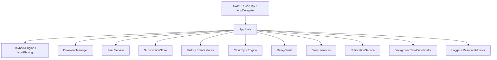
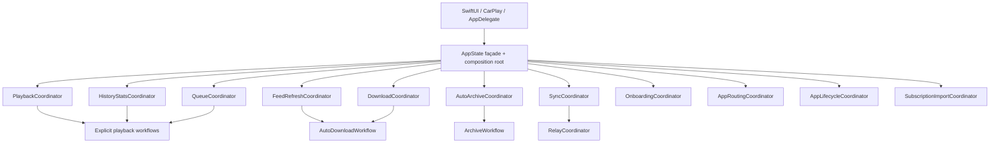

# Autohop AppState Decomposition Proposal

<!--
AI CONTEXT — APPSTATE_DECOMPOSITION_PROPOSAL.md

PURPOSE:
This document is the authoritative architecture review and staged implementation
proposal and execution ledger for decomposing the iOS App/AppState.swift file.
It does not authorize a future AI model to change runtime behavior or combine
unapproved migration stages into one edit. Completed stages are recorded below.

REVIEW SNAPSHOT:
- Review date: 2026-07-17, Australia/Melbourne.
- Git branch: main.
- Base commit: d8e0320488e4.
- Source reviewed: the live working tree, including uncommitted Version 1.4 work.
- App/AppState.swift length at review: 6,645 lines.
- The AppState class begins at line 339; ListeningHistoryStore is physically
  colocated at lines 6,333–6,645.
- Approximately 31 Swift files access `appState`, using about 100 distinct member
  names outside App/AppState.swift.

IMPLEMENTATION SNAPSHOT:
- Stages 0–14 implementation-complete: 2026-07-19,
  Australia/Melbourne. Release-candidate device validation remains a separate
  recorded QA activity.
- Implementation task-entry commit: d95f29ab4b81b9609ac4f565260d253c4c08e3a0.
- Stage 0 evidence: APPSTATE_DECOMPOSITION_BASELINE.md.
- AppCompositionRoot now constructs the production dependency graph.
- AppState construction and idempotent runtime start are separate.
- ListeningHistoryStore, ReleaseRadarCyclePlanner/DTOs, PlaybackClock,
  DownloadProgressModel, and warning-cue generation are physically separated.
- HistoryStatsCoordinator, QueueCoordinator, OnboardingCoordinator,
  AppRoutingCoordinator, DownloadCoordinator, FeedRefreshCoordinator,
  AutoDownloadWorkflow, and AutoArchiveCoordinator own their approved domains.
- SubscriptionImportCoordinator, SyncCoordinator, RelayCoordinator, and
  PlaybackCoordinator own their approved domains.
- Stage 13 view migration and compatibility-forwarding audit are complete.
- Stage 14 extracted the remaining callback, transaction, runtime, and startup
  implementations into typed owners. AppState now owns singleton identity and
  compatibility API shape only. At the user's direction, the original
  Definition of Done is tracked as Stage 14 final cleanup; numbered document
  sections such as the rollback strategy retain their original meaning.

AUTHORITATIVE EXECUTION RULES FOR FUTURE AI MODELS:
1. Re-read the current code before implementing any stage. Symbol names, line
   numbers, behavior, and dependencies may have changed after this review.
2. Preserve behavior before improving structure. Every stage requires
   characterization tests and an explicit validation gate.
3. Implement only one ownership transfer at a time. Never perform a big-bang
   rewrite of AppState.
4. Keep exactly one writer for each mutable domain. Never run legacy and new
   coordinators as simultaneous side-effecting implementations.
5. AppCompositionRoot owns iOS construction from Stage 1 onward. AppState
   remains the process singleton and compatibility façade until the final
   migration stage.
6. Preserve the current iPhone, CarPlay, background-download, lock-screen,
   CloudKit, and background-task entry points throughout the migration.
7. Update AI CONTEXT headers in every moved or newly created file. Headers must
   state ownership, dependencies, concurrency, persistence, event contracts,
   invariants, and prohibited responsibilities.
8. Update DESIGN.md, FEATURES.md, PAGES.md, SYNC_DESIGN.md, README.md, and
   project_autohop.md only when a completed stage materially changes the
   architecture described by those documents.
9. Do not treat a lower line count as proof of success. Ownership clarity,
   transaction correctness, cancellation safety, testability, and unchanged
   user-visible behavior are the acceptance criteria.
-->

## 1. Executive decision

AppState should be decomposed, but it should not be replaced in one operation.
The safe target is a small `@MainActor` composition root and high-level observable
façade backed by domain coordinators with exclusive state ownership.

The current AppState is not merely an oversized view model. It is simultaneously:

- the dependency container;
- the application bootstrapper;
- an observable UI state object;
- a callback registry;
- a playback session controller;
- a queue controller;
- a download workflow engine;
- a feed-refresh scheduler;
- an auto-download intent processor;
- an auto-archive engine;
- a CloudKit integration layer;
- an Autohop Relay integration layer;
- a lifecycle and background-work adapter;
- an onboarding controller;
- an OPML import/export controller;
- a history and Stats recorder;
- a diagnostics context provider.

This concentration creates high regression risk because a method that appears to
belong to one feature often maintains invariants in several other domains. For
example, episode completion updates playback, history, Stats, local media,
subscription state, sleep behavior, Play Instant state, Now Playing metadata, and
queue advancement. Moving only the visually obvious lines would break the
transaction.

The recommended implementation order is deliberately risk-weighted:

1. Freeze and test current behavior.
2. Introduce composition and protocol seams without changing ownership.
3. Move physically independent leaf types.
4. Extract low-risk onboarding, routing, history/Stats, and queue ownership.
5. Extract downloads before feed refresh because refresh depends on downloads.
6. Extract feed refresh, auto-archive, sync, and Relay with explicit adapters.
7. Extract playback, Play Instant, chapters, and sleep integration after their
   dependencies have stable coordinator interfaces.
8. Move lifecycle/bootstrap wiring last.
9. Retain AppState as a compatibility façade, then reduce view dependencies
   gradually.

### 1.1 Implementation status

| Item | Status at 2026-07-19 |
|---|---|
| Current-code inventory | Complete |
| Durability and reliability review | Complete |
| Target ownership design | Complete |
| Staged implementation strategy | Complete |
| Stage 0 characterization work | Complete — see `APPSTATE_DECOMPOSITION_BASELINE.md` |
| Stage 1 explicit composition/start | Complete |
| Stage 2 independent leaf moves | Complete |
| Stage 3 HistoryStatsCoordinator | Complete |
| Stage 4 QueueCoordinator | Complete |
| Stage 5 onboarding/routing adapter | Complete |
| Stage 6 DownloadCoordinator | Complete |
| Stage 7 FeedRefreshCoordinator and AutoDownloadWorkflow | Complete |
| Stage 8 AutoArchiveCoordinator | Complete |
| Stage 9 SubscriptionImportCoordinator | Complete |
| Stage 10 SyncCoordinator and RelayCoordinator | Complete |
| Stage 11 PlaybackCoordinator | Complete |
| Stage 12 AppLifecycleCoordinator | Complete |
| Stage 13 façade/view migration | Complete — narrow page observation and compatibility-forwarding audit finished |
| Stage 14 final cleanup / Definition of Done | Implementation complete — final local build/test validation recorded below; release-candidate device scenarios remain QA |

Stages 0–14 are implementation-complete. Existing policy extractions such as
PlaybackPositionStore, PlaybackSessionPolicy, and QueueModel remain current-state
inputs. Domain coordinators and named workflows exclusively own download
runtime, refresh/Radar state, durable intent draining, Auto Archive, import,
CloudKit, Relay, playback, queue, chapters, media, history/Stats, onboarding,
runtime policy, and ordered startup. AppState retains stable high-level
compatibility entry points but owns no domain callback, retained task,
persistence transaction, or state-machine body.

## 2. Scope and non-goals

### 2.1 In scope

- Review the current purpose, durability, reliability, concurrency, persistence,
  observability, and external API of AppState.
- Define the final ownership boundary of every responsibility currently located
  in App/AppState.swift.
- Define cross-domain transaction contracts that preserve current behavior.
- Define staged implementation work, test gates, rollback boundaries, and
  completion criteria.
- Identify existing architectural seams that should be reused.
- Identify additional coordinators required by the current code, even when they
  were absent from the earlier seven-item recommendation.

### 2.2 Out of scope

- The original review did not implement Swift. The later Stage 0–2 execution
  recorded by this ledger changes structure only, not product behavior.
- No user-visible behavior, settings default, persistence format, sync schema,
  queue rule, release scheduling rule, or background policy is changed.
- No tvOS feature expansion is proposed.
- No switch from Combine to the Observation framework is required.
- No database migration is required merely to split AppState.
- No generic event bus, service locator, or dependency-injection framework is
  recommended.
- No line-count-only refactor, such as splitting one class into extension files
  while retaining the same ownership, is considered sufficient.

## 3. Current implementation inventory

### 3.1 Physical layout

The reviewed App/AppState.swift was 6,645 lines. After Stage 2 it was
approximately 6,250 lines; after Stages 3–5 it was approximately 6,150 lines.
After Stages 6–8 it is approximately 5,880 lines because domain state and the
Auto Archive rule engine moved into dedicated owners. The
table below remains the authoritative pre-migration inventory.

| Approximate range | Current responsibility |
|---|---|
| 1–338 | AI context, Release Radar planning DTOs, `ReleaseRadarCyclePlanner`, `PlaybackClock`, `DownloadProgressModel` |
| 339–833 | AppState collaborators, mutable state, queue cache, onboarding state, player helpers, refresh policy and diagnostic types |
| 834–1,047 | Initializer, CloudKit callbacks, store observation, settings observation, network monitor startup |
| 1,048–1,554 | Static bootstrap, playback/download/sleep/Now Playing callback wiring, migrations, launch tasks |
| 1,555–1,820 | Playback controls, seeking, chapter filtering and navigation |
| 1,821–2,517 | Download operations, archive/mark-played workflows, download queue and cached activity/history refresh |
| 2,518–2,702 | Play Instant interruption state machine and warning-tone generation |
| 2,703–3,369 | Queue commands, playback preferences, Shared Listening, start playback, episode completion |
| 3,370–5,067 | Feed refresh, auto-download intent handling, refresh cycles, Release Radar planning, background scheduling, full-history load, auto-archive |
| 5,068–5,189 | OPML import, export, and bulk subscribe |
| 5,190–5,256 | Playback-tick diagnostics, playback-position and sync checkpoints |
| 5,257–5,650 | Autohop Relay registration, membership sync, circuit breaking, sync nudge, heartbeat, push dispatch |
| 5,651–5,956 | Queue pin persistence, position restore, history helpers, media-file repair, external chapter loading |
| 5,957–6,332 | Scene lifecycle, resource diagnostics, foreground/background-audio polling, settings synchronization, notifications |
| 6,333–6,645 | Pre-Stage-2 location of `ListeningHistoryStore` inside AppState.swift |

The physical ranges are snapshot guidance, not stable source anchors. Future work
must locate symbols by name.

### 3.2 Current collaborators owned or orchestrated by AppState

AppState directly holds or constructs:

- `FeedServicing`;
- `DownloadManaging`;
- `PlaybackControlling`;
- `ChapterServicing`;
- `QueueServicing`;
- `SettingsStoring`;
- `SubscriptionStore`;
- `ListeningHistoryStore`;
- `ListeningStatsStore`;
- `AutoArchiveActivityStore`;
- `AutoDownloadIntentStore`;
- `DownloadActivityStore`;
- `PlaybackPositionStore`;
- `CloudSyncEngine`;
- `AutohopProStore`;
- `RelayClient.shared`;
- `SleepTimerService`;
- `SleepScheduleService`;
- `NWPathMonitor`;
- `AppLogger.shared`;
- `ResourceMonitor.shared`;
- `NowPlayingService.shared`;
- `NotificationService.shared`;
- background task scheduling through `BackgroundTaskCoordinator`;
- artwork-cache memory trimming through `ArtworkImageCache.shared`.

The initializer accepts several protocols, which is a strong starting point, but
bootstrap also constructs concrete services and installs a large callback graph.

### 3.3 Current observable state

AppState publishes or forwards:

- current player episode;
- playing/paused state;
- Up Next episode;
- queue pin arrays;
- onboarding tip and toast;
- downloaded activity cache;
- grouped listening history;
- completed episode count;
- download and playback messages;
- OPML import progress;
- changes from `SubscriptionStore`;
- changes from `SettingsStore`;
- changes from both sleep services.

Two high-frequency streams have already been separated correctly:

- `PlaybackClock` owns the 2 Hz player time.
- `DownloadProgressModel` owns per-episode progress.

These should remain dedicated observables. They establish the correct pattern for
future coordinator-specific observation.

### 3.4 Current external surface

Approximately 31 Swift files reference `appState`, including the iPhone views,
AutohopApp, AppDelegate, CarPlay, and tests. About 100 distinct AppState member
names are referenced externally.

The most common direct dependencies are:

- `subscriptionStore`;
- `settingsStore`;
- `currentPlayerEpisode`;
- `downloadedQueue`;
- download, archive, and playback commands;
- `isPlaying`;
- playback-time helpers;
- history and Stats stores;
- sleep services;
- refresh and Release Radar diagnostics;
- onboarding state.

This means moving a property out of AppState is not a local edit. The migration
must retain façade-compatible access until each caller is deliberately converted.

### 3.5 Entry points that must remain stable

The following callers can create or reach AppState outside the normal SwiftUI
window lifecycle:

- `AutohopRootBootstrapView`;
- `AppDelegate`;
- `CarPlayCoordinator`;
- background URLSession relaunch handling;
- BGAppRefresh and BGProcessing handlers;
- Relay silent-push handling;
- OPML file-open handling.

`AppState.sharedOrBootstrap()` therefore cannot be removed early. A CarPlay-only
cold launch and a background task may require application services before the
iPhone WindowGroup exists.

## 4. Current purpose and runtime topology

### 4.1 AppState’s legitimate purpose

AppState has a valid architectural role:

- construct the iOS application graph;
- expose stable high-level state and commands to SwiftUI and CarPlay;
- adapt process-level events into application commands;
- preserve one shared application instance across phone, CarPlay, and background
  entry points.

Those responsibilities should remain.

### 4.2 Responsibilities that do not belong in the final AppState

AppState should not permanently own:

- feed prediction caches and refresh backlogs;
- download retry state and transfer queues;
- Play Instant’s internal state machine;
- queue pin files and queue snapshot publication;
- playback-position persistence rules;
- listening-history persistence;
- auto-archive rule evaluation;
- Relay retry and membership state;
- CloudKit materialization logic;
- OPML import loops;
- warning-tone PCM generation;
- network-path monitoring;
- per-domain diagnostic aggregation;
- long-running polling loops;
- direct callback installation for every service.

### 4.3 Current dependency shape

The current topology is effectively a star whose center also contains most
workflow logic:



The desired topology keeps AppState at the top but moves domain state and
workflow ownership behind explicit interfaces:



No coordinator should reach back into AppState. Dependencies point inward toward
protocols and leaf services, never upward toward the façade.

## 5. Durability assessment

### 5.1 Overall verdict

Current local durability is strong, but its guarantees are distributed across
many AppState methods and callbacks. The primary risk is not that persistence is
absent; it is that a future extraction could unknowingly change the ordering or
omit a checkpoint.

### 5.2 Existing durability strengths

#### D-S1 — Durable auto-download intent precedes asynchronous work

`scheduleAutoDownloadAfterRefresh` records an `AutoDownloadIntentStore` row before
creating the asynchronous download task. Launch, foreground, BGAppRefresh, and
BGProcessing paths drain unresolved intents. This protects feed discoveries from
process suspension between merge and transfer start.

This ordering is a required invariant:

`persist intent → launch attempt → settle only after terminal policy state`.

#### D-S2 — Playback position has a dedicated store

`PlaybackPositionStore` already owns keys, cache behavior, disk format, restore
selection, clamping, and legacy decoding. AppState retains only wrappers and tick
timing. This is the best existing example of a safe extraction.

#### D-S3 — Lifecycle checkpoints flush throttled state

Pause, background, sleep timer, sleep schedule, and completion paths explicitly
save position/history/Stats and flush deferred CloudKit pushes. The data is
batched during playback but forced at lifecycle boundaries.

#### D-S4 — Queue pins survive launch and locked-device use

Queue pin data is stored under Application Support and uses protected-file
handling suitable for CarPlay after first unlock.

#### D-S5 — Subscription and sync state use durable stores

`SubscriptionStore` is SQLite-backed. `CloudSyncEngine` leaves outgoing rows dirty
until successful upload. Failed or deferred CloudKit transmission therefore does
not erase the local repair source.

#### D-S6 — Background downloads survive process death

`DownloadManager` uses a background URLSession and exposes a completion callback
for relaunch delivery. AppState reconciles the resulting file, episode state,
duration, Stats, activity, notification, Play Instant eligibility, and durable
intent.

#### D-S7 — Auto-archive activity is recorded

The current auto-archive engine records an audit entry describing the responsible
rule and measured threshold context. That record must be committed as part of the
archive workflow, not as an optional UI-side effect.

### 5.3 Durability risks

#### D-R1 — Checkpoint logic is duplicated

Different pause/finish/background paths call overlapping but non-identical sets of:

- playback-position save or clear;
- history save or mark;
- Stats save;
- deferred sync flush;
- Now Playing update or clear;
- local media deletion;
- subscription-state transition.

An extraction that moves only one path can introduce inconsistent durability.
The target architecture needs named checkpoint operations such as:

- `checkpointActivePlayback(reason:)`;
- `commitEpisodeCompletion(...)`;
- `commitArchive(...)`;
- `flushSyncVisiblePlaybackData(reason:)`.

#### D-R2 — Some persistence is triggered by reads

The `downloadedQueue` getter recomputes the queue and writes the local queue sync
snapshot. A read accessor therefore has an external persistence side effect.
This is difficult to reason about, can make tests order-dependent, and can produce
unexpected work from diagnostic or badge reads.

**Resolution status: complete in Stage 4 (2026-07-18).** QueueCoordinator
publishes snapshots only when the ordered episode identity sequence changes and
all compatibility getters are side-effect free. SubscriptionStore exposes a
narrow queue-affecting event instead of using broad objectWillChange for queue
work.

#### D-R3 — Persistence ownership is not exclusive

AppState, stores, service callbacks, and lifecycle code can all initiate saves or
state transitions. Final ownership must assign one writer per persisted domain.

#### D-R4 — Bootstrap completion is not a durable state machine

`AppState.shared` is published before all callbacks and launch tasks are wired to
prevent duplicate instances. This is a reasonable reentrancy defense, but callers
can theoretically receive a partially started object. The final composition root
needs explicit construction and start phases with idempotent startup state.

## 6. Reliability and maintainability assessment

### 6.1 Overall verdict

| Dimension | Assessment | Reason |
|---|---|---|
| Runtime safeguards | Strong | Backoff, bounded retries, durable intents, conditional HTTP, fairness, memory checkpoints, lifecycle flushes |
| Data durability | Strong but dispersed | Persistence exists, but transaction ordering is spread across callbacks |
| Observability | Strong | Detailed diagnostics, resource snapshots, refresh-cycle attribution, tick summaries |
| Change isolation | Weak | A small feature often touches several unrelated domains in one class |
| Unit testability | Weak to moderate | Pure policies are tested; most AppState orchestration is only indirectly tested |
| Concurrency clarity | Moderate | MainActor serializes state, but many unstructured tasks and callbacks obscure ownership |
| UI invalidation precision | Moderate | High-frequency streams are split; broad manual forwarding remains |
| Bootstrap reliability | Moderate | Reentrancy is guarded, but startup wiring is large and partially exposed |
| Architectural cohesion | Weak | AppState mixes composition, policy, persistence, transport, and presentation |

### 6.2 Existing reliability strengths

#### R-S1 — MainActor serialization

AppState is `@MainActor`. UI-facing state transitions and most store coordination
are serialized. This prevents many classes of data race and should be retained for
observable coordinators.

#### R-S2 — Protocol-backed primary services

Feed, download, playback, chapter, queue, and settings dependencies already have
protocol seams. CarPlay tests construct AppState with in-memory and spy
implementations. These seams should be extended, not replaced.

#### R-S3 — Pure policies are already extracted

The following decision logic already lives outside AppState:

- `PlaybackSessionPolicy`;
- `PlaybackSeekBoundaryPolicy`;
- `QueueModel`;
- `QueueService`;
- `FeedRefreshScheduling`;
- `FeedRefreshPrioritizer`;
- `FeedRefreshBudgeting`;
- `BackgroundTaskCoordinator`;
- `ReleaseRadarCyclePlanner`, although the last remains physically in
  AppState.swift.

The decomposition should move effect execution while preserving these pure
policies as the behavioral source of truth.

#### R-S4 — Bounded failure behavior

Download watchdog retries, feed failures, Relay requests, auto-download failures,
background scheduling, and refresh selection all have bounded or backed-off
behavior.

#### R-S5 — Off-main planning and parsing boundaries

Release Radar candidate planning uses immutable snapshots in a detached utility
task. Feed parsing/merge paths use autorelease boundaries and batch memory
checkpoints. These performance protections must remain after extraction.

### 6.3 Reliability findings

#### AS-01 — Bootstrap is a high-risk callback registry

Severity: high change risk.

`bootstrap()` is approximately 500 lines. It installs playback, download,
watchdog, sleep, notification, Now Playing, migration, polling, monitoring,
archive, reconciliation, badge, and restore behavior.

The callback graph has implicit ordering and shared mutable capture. Adding one
callback can affect startup timing, task lifetime, and another callback’s state.

Repair direction:

- each coordinator installs callbacks on its own service;
- callback installation becomes idempotent;
- `AppCompositionRoot` constructs dependencies;
- `AppLifecycleCoordinator.start()` starts long-lived work after every
  coordinator is fully constructed.

#### AS-02 — Cross-domain transactions are implicit

Severity: high correctness risk during refactor.

Natural completion, manual mark played, manual archive, seek-to-end, remote Next,
download completion, and auto-archive each update several domains in different
orders.

Repair direction:

- define explicit application workflows;
- represent cause separately from resulting state;
- use a single transaction method per user intent;
- characterize current ordering before moving code.

#### AS-03 — Mutable state machines use loose fields

Severity: high reliability and cancellation risk.

Play Instant, Relay feed sync, Relay nudge, download retry, refresh cycle, and
polling state are represented by combinations of booleans, dictionaries, arrays,
and optional tasks.

Examples include:

- `relayRegistrationInFlight`;
- `relayFeedSyncInFlight`;
- `relayFeedSyncNeedsReconcile`;
- `relayForceFullFeedSync`;
- `playInstantQueue`;
- `playInstantInterruptedSession`;
- `activePlayInstantEpisodeID`;
- `playInstantTransitionTask`;
- `activeRefreshCycle`;
- `activeRefreshCycleDiagnostics`;
- `isDrainingAutoDownloadIntents`.

Repair direction:

- define explicit state enums or state structs;
- make legal transitions visible;
- have the owning coordinator cancel and clear every task;
- log state transitions, not isolated flags.

#### AS-04 — Task ownership is fragmented

Severity: high lifecycle risk.

AppState creates many `Task` values, but only some are stored. The permanent
foreground poller, background diagnostic delays, notification tasks, startup
tasks, and callback tasks do not share a cancellation scope.

Repair direction:

- each coordinator owns a `start()`/`stop()` lifecycle;
- every long-lived task is stored by its owner;
- one-shot tasks use structured `async` calls where the caller needs the result;
- detached tasks accept immutable `Sendable` snapshots;
- shutdown and test teardown cancel tasks deterministically.

#### AS-05 — Broad observation hides causality

Severity: medium-high performance and correctness risk.

The `SubscriptionStore.objectWillChange` sink:

- invalidates the queue cache;
- schedules Up Next;
- checks onboarding;
- manually forwards AppState change;
- updates the badge;
- detects Relay membership changes.

The settings observer casts the `SettingsStoring` protocol back to concrete
`SettingsStore`, manually forwards change, and defers reads because
`objectWillChange` fires before mutation.

Repair direction:

- expose typed post-change events or revision streams;
- observe feed membership separately from episode changes;
- observe queue-affecting revisions separately from refresh-stat changes;
- replace manual pre-change forwarding with explicit post-mutation outputs;
- do not make the coordinator depend on a concrete store behind a protocol.

#### AS-06 — Playback has two state authorities

Severity: high correctness risk.

AppState publishes `isPlaying`, `currentPlayerEpisode`, and current time while
`PlaybackEngine` independently exposes its own episode and playing state.
Defensive code frequently checks both.

Repair direction:

- PlaybackCoordinator becomes the only application-level session authority;
- engine state is an input to the coordinator, not a second UI source of truth;
- a `PlaybackSnapshot` is updated atomically;
- diagnostic mismatch detection remains available.

#### AS-07 — AppState’s public surface is too broad

Severity: medium-high change risk.

Views can read stores directly and invoke cross-domain methods. This prevents the
compiler from enforcing ownership.

Repair direction:

- retain compatibility properties during extraction;
- mark new coordinator internals private;
- expose read-only snapshots and intent-named commands;
- migrate views by page after coordinator behavior is stable.

#### AS-08 — The global singleton is necessary today but overused

Severity: medium testability risk.

`AppState.shared` supports CarPlay and background cold launches, but direct global
access appears throughout AppDelegate and CarPlay.

Repair direction:

- retain the shared accessor during migration;
- place construction in `AppCompositionRoot`;
- inject AppState into CarPlayCoordinator and AppDelegate after bootstrap;
- keep `sharedOrBootstrap()` as a narrow process-entry fallback;
- never allow coordinators to resolve dependencies through the singleton.

#### AS-09 — MainActor contains non-UI work

Severity: medium performance risk.

AppState performs iteration, queue composition, file existence checks, metadata
lookups, WAV generation, logging metadata assembly, and some planning while
MainActor-isolated.

Repair direction:

- keep observable mutation on MainActor;
- move pure computation to value-type policies;
- move filesystem/network work behind async services or actors;
- pass immutable results back to the MainActor owner.

#### AS-10 — Routing is distributed rather than centralized

Severity: medium maintainability risk.

The earlier recommendation named an App routing coordinator, but current routing
mostly lives in RootView, MenuSheetView, NotificationCenter names, notification
handlers, and launch logic. AppState only contributes onboarding conditions and
milestone notifications.

Repair direction:

- do not pretend routing can be extracted solely from AppState;
- define typed `AppRoute` and `AppRouteCommand`;
- migrate NotificationCenter navigation events to a routing coordinator only
  after RootView behavior is characterized;
- keep PlayerView as the permanent root.

**Resolution status: Stage 5 foundation complete (2026-07-18).**
AppRoutingCoordinator now owns typed launch and presentation commands and
translates the existing NotificationCenter producers. RootView intentionally
retains its local NavigationPath and permanent PlayerView root; migrating every
legacy producer is deferred without changing navigation behavior.

#### AS-11 — History persistence is physically misplaced

Severity: low runtime risk, medium ownership confusion.

Review finding: `ListeningHistoryStore` was a separate class defined at the
bottom of AppState.swift.

**Resolution status: complete in Stage 2 (2026-07-18).** The implementation now
lives in `Persistence/ListeningHistoryStore.swift`; its JSON path, Codable
payload, sync projection, batching, repair rules, and MainActor isolation remain
unchanged. HistoryStatsCoordinator now owns history/Stats orchestration.

#### AS-12 — Core AppState orchestration has limited direct tests

Severity: high migration risk.

Pure policies have focused tests. Direct AppState construction is currently most
visible in CarPlay behavior tests. Important orchestration remains app-target
code and is difficult to exercise without real services.

Repair direction:

- characterization tests are Stage 0, not a later cleanup;
- create protocol-backed workflow tests before moving each domain;
- maintain real-device validation for CloudKit, background URLSession, CarPlay,
  audio routes, and BGTask behavior.

#### AS-13 — Minor stale code exists inside critical wiring

Severity: low.

The reviewed playback time callback contains a duplicated `guard let state else`
statement. This is harmless but demonstrates how difficult it is to visually
audit a 500-line bootstrap method.

This should be removed only during an approved implementation stage, with no
behavioral changes mixed into ownership migration.

## 7. Target architecture principles

### 7.1 Single writer per domain

Every mutable state group has exactly one owning coordinator.

| Mutable domain | Exclusive owner |
|---|---|
| Loaded episode, play state, playback position projection, chapters, Play Instant session | PlaybackCoordinator |
| Ordered downloaded queue, pin state, Up Next projection, queue snapshot publication | QueueCoordinator |
| Pending/active downloads, progress, retry state, activity projection, network gating | DownloadCoordinator |
| Refresh cycle, prediction cache, backlog, feed backoff, polling cadence | FeedRefreshCoordinator |
| Auto-archive gate, rule evaluation, activity records | AutoArchiveCoordinator |
| Listening progress, completion history, Stats credits and flush checkpoints | HistoryStatsCoordinator |
| CloudKit lifecycle, remote apply orchestration, sync flush | SyncCoordinator |
| Relay registration, feed membership, push mapping, nudge and heartbeat | RelayCoordinator |
| First-run state, tips, milestones, onboarding toast | OnboardingCoordinator |
| Main navigation path and typed route requests | AppRoutingCoordinator |
| Process/scene lifecycle, startup and shutdown task ownership | AppLifecycleCoordinator |
| OPML and starter-pack subscription workflows | SubscriptionImportCoordinator |

### 7.2 Explicit dependencies

Use small purpose-specific protocols. A coordinator must not receive all of
AppState or a general service locator.

Examples of conceptual interfaces:

- `PlaybackQueueProviding`;
- `PlaybackHistoryRecording`;
- `PlaybackPositionPersisting`;
- `DownloadRequesting`;
- `FeedRefreshRequesting`;
- `ArchiveCommitting`;
- `SyncCheckpointing`;
- `ApplicationStateProviding`;
- `NetworkPolicyProviding`;
- `BackgroundRefreshScheduling`;
- `NotificationPosting`.

These names describe planning intent. Exact names must be chosen against the
current code during implementation.

### 7.3 Typed events, not generic notifications

Core workflows must not use stringly typed NotificationCenter messages or a
generic event bus.

Use typed, domain-specific events such as:

- playback reached end with a cause;
- download completed with provenance;
- feed merge discovered an eligible episode;
- archive committed with a rule;
- remote subscription requires materialization;
- route requested.

NotificationCenter can remain at OS/UI boundaries until the routing stage.

### 7.4 Explicit application workflows

Some operations legitimately cross coordinator boundaries. They should be named
workflows rather than hidden coordinator-to-coordinator calls.

Recommended workflow objects:

- `StartPlaybackWorkflow`;
- `EpisodeCompletionWorkflow`;
- `EpisodeArchiveWorkflow`;
- `AutoDownloadWorkflow`;
- `BackgroundDownloadCompletionWorkflow`;
- `RemoteSubscriptionMaterializationWorkflow`;
- `PlaybackCheckpointWorkflow`.

A workflow may call several coordinator protocols in a documented order. It does
not own long-lived state.

### 7.5 Preserve high-frequency observation isolation

Do not reintroduce whole-app invalidation.

- Playback time stays in `PlaybackClock` or a coordinator-owned equivalent.
- Download progress stays in `DownloadProgressModel` or a coordinator-owned
  equivalent.
- Queue state, history summaries, and onboarding state publish only on actual
  value changes.
- AppState should not manually forward every child `objectWillChange`.
- Views should eventually observe the smallest relevant coordinator or model.

### 7.6 Separate construction from start

Every long-lived coordinator should support:

1. synchronous construction with complete dependencies;
2. idempotent callback installation;
3. explicit asynchronous or synchronous `start`;
4. explicit `stop` for tests and teardown.

`AppState.shared` must not expose a graph whose domain callbacks are only
partially installed.

### 7.7 Preserve pure policy ownership

Pure decision types remain free of UIKit, SwiftUI, stores, logging, and network
effects. Coordinators execute decisions; they do not duplicate policy logic.

## 8. Proposed coordinator boundaries

## 8.1 AppState — composition root and compatibility façade

### Owns

- references to all coordinators and stable shared observables;
- the process-wide shared instance during the compatibility period;
- high-level command delegation used by existing views and CarPlay;
- read-only composition-level access required during staged migration.

### Does not own

- domain state machines;
- persistence rules;
- retry/backoff state;
- service callbacks;
- polling tasks;
- queue computation;
- feed planning;
- history or Stats mutation;
- navigation-path mutation.

### Final behavior

AppState should be inexpensive to construct from an already-built
`AppCompositionRoot`. Its methods should be short delegations or high-level
workflow invocations.

The final class may still expose compatibility names such as `playEpisode`,
`archiveEpisode`, or `refreshAllSubscriptions`, but their implementations should
delegate immediately.

### Target size

A practical final guardrail is approximately 600–1,000 lines including AI
context and compatibility methods. This is not an acceptance criterion. A
1,200-line cohesive façade is better than a 400-line façade that hides global
state or generic event routing.

## 8.2 PlaybackCoordinator

### Owns

- current loaded episode;
- authoritative playing/paused state;
- playback clock projection;
- engine callback installation;
- play, pause, resume, seek, forward/back skip;
- seek-to-completion classification;
- effective playback preference application;
- chapter filtering and navigation;
- external chapter application to the active session;
- Now Playing metadata and command synchronization;
- launch and CarPlay resume behavior;
- Play Instant session state through a dedicated child state machine;
- sleep timer/schedule integration through explicit adapters;
- playback-specific diagnostics.

### Dependencies

- `PlaybackControlling`;
- `ChapterServicing`;
- subscription read/update interface;
- queue read interface;
- playback-position persistence;
- history/Stats workflow interface;
- download-on-missing-media interface;
- Now Playing adapter;
- sleep adapter;
- logger/resource diagnostics;
- clock and scheduler abstractions for tests.

### Publishes

A single atomic `PlaybackSnapshot` conceptually containing:

- episode;
- state: idle, loading, playing, paused, interrupted, finishing, failed;
- position projection;
- duration;
- active chapters/current chapter;
- effective preference;
- user-facing error.

High-frequency position remains a dedicated observable.

### Invariants

- coordinator state is the application authority; engine state is reconciled
  input;
- only one active start/seek/finish transition per episode generation;
- stale callbacks from a prior episode generation are ignored;
- a seek to the completion tolerance runs the completion workflow;
- manual Next and user episode selection cancel Play Instant restoration;
- natural completion of a Play Instant episode restores the interrupted session;
- completed interrupted episodes are never resurrected;
- live preference updates affect only the matching active subscription;
- start playback does not block on external chapter network retrieval.

### Recommended child components

- `PlayInstantStateMachine`;
- `PlaybackCheckpointService`;
- `ExternalChapterLoader`;
- `SleepPlaybackAdapter`;
- existing `PlaybackSessionPolicy`.

The child components should not publish application-wide state.

## 8.3 QueueCoordinator

### Owns

- cached ordered downloaded queue;
- Play Next and Play Last pin arrays;
- queue pin persistence;
- Up Next resolution;
- queue invalidation revisions;
- badge count projection;
- explicit CloudKit queue-snapshot publication.

### Dependencies

- subscription read stream with a queue-affecting revision;
- `QueueServicing`;
- `QueueModel`;
- queue-pin store;
- sync queue-snapshot writer;
- badge adapter.

### Publishes

- queue episodes;
- Up Next episode;
- pin status;
- queue count.

### Invariants

- queue contains downloaded, local-file-backed, unplayed, unarchived episodes;
- subscription priority and within-podcast ordering remain unchanged;
- Play Next and Play Last semantics match `QueueModel`;
- queue reads are side-effect free;
- snapshot publication occurs once per changed queue identity sequence;
- bulk subscription changes coalesce to one recompute;
- current episode is excluded only when resolving Up Next, not silently removed
  from every queue representation.

## 8.4 DownloadCoordinator

This coordinator is required even though it was absent from the earlier
seven-item summary. Downloads currently occupy roughly 700 AppState lines and
are a dependency of playback, feed refresh, archive, CarPlay, and background
relaunch.

### Owns

- download concurrency limit;
- pending FIFO;
- active slot count;
- network policy evaluation;
- download progress model;
- download activity store orchestration;
- pause, resume, retry, cancel, delete;
- watchdog retry state;
- auto-download failure cooldown;
- orphan reconciliation;
- reusable-file and path repair checks;
- background URLSession callback installation.

### Does not own

- whether a refreshed episode is eligible under feed policy;
- auto-archive decisions;
- Play Instant interruption state;
- queue ordering;
- listening-history outcomes.

### Dependencies

- `DownloadManaging`;
- subscription download-state mutation interface;
- settings/network-policy interfaces;
- local media metadata service;
- activity store;
- Stats download-credit interface;
- notification output;
- logger.

### Publishes

- active and completed activity snapshots;
- dedicated progress model;
- user-facing download result;
- typed `DownloadReceipt` containing provenance.

### Invariants

- at most three active download attempts unless product policy changes;
- background and foreground completion converge on one completion workflow;
- automatic provenance comes from a durable intent, not a guessed call path;
- exhausted watchdog work cannot generate further callbacks;
- manual retries remain possible after automatic retry exhaustion;
- cancellation and superseded one-item feed cleanup are idempotent;
- a missing-file repair updates durable episode state exactly once;
- no feed refresh waits for a media transfer.

## 8.5 FeedRefreshCoordinator

### Owns

- conditional refresh of one subscription;
- release observation updates;
- feed metadata and episode merge orchestration;
- per-feed backoff;
- Release Radar profile cache;
- refresh prediction and candidate planning;
- refresh budget selection;
- deferred-backlog fairness;
- active cycle state and cancellation;
- background-audio polling cadence and resource-reduced budgets;
- manual, BGAppRefresh, BGProcessing, and Relay-trigger attribution;
- next-due background scheduling;
- refresh diagnostics and memory checkpoints.

### Dependencies

- `FeedServicing`;
- subscription read/write interface;
- pure Release Radar policies;
- auto-download workflow;
- queue invalidation output;
- auto-archive trigger interface;
- application/thermal/power/network state providers;
- background scheduler;
- resource monitor;
- logger.

### Publishes

- current cycle snapshot;
- Release Radar schedule diagnostics;
- last cycle outcome;
- backlog diagnostic summary.

### Invariants

- conditional validators remain per subscription;
- normal refresh parsing remains capped at the current episode limit;
- browse previews merge display data but never auto-download;
- download filters determine auto-download and release-learning eligibility;
- media transfer is scheduled after merge and never awaited by the refresh cycle;
- active cycles join or reject according to explicit policy;
- cancellation restores unfinished selected candidates to fairness state;
- failed feeds respect backoff;
- background wake selection uses the later of due date and active backoff;
- background-audio cycles retain current limits and resource-pressure reductions;
- large cycles remain sequential and retain autorelease/memory batch boundaries.

### Recommended leaf extraction

Move `ReleaseRadarCyclePlanner` and its immutable DTOs into a dedicated
Feeds/ReleaseRadarCyclePlanner.swift file before moving the coordinator.

## 8.6 AutoArchiveCoordinator

Auto Archive should not be hidden inside FeedRefreshCoordinator. It has its own
time gate, rules, audit history, and direct user-facing page.

### Owns

- 25-minute gate;
- After Playing evaluation;
- Inactive Episodes evaluation;
- Episode Limit evaluation;
- pre-subscription backlog protection;
- active-player protection;
- per-run deduplication;
- eligibility diagnostics;
- `AutoArchiveActivityStore` writes.

### Dependencies

- subscription/episode read interface;
- archive workflow;
- current playback identity provider;
- clock;
- settings store for last-run time;
- logger.

### Invariants

- current player episode is protected;
- filter-skipped episodes do not distort drift statistics;
- inactive eligibility requires `downloadedAt`;
- inactivity age uses the most recent applicable download/play activity;
- pre-subscription backlog remains protected;
- episode-limit candidates retain current download-state rules;
- archive history records rule, configured threshold, measured age, and date;
- an automatic storage cleanup cannot overwrite a completed listening-history
  outcome.

## 8.7 HistoryStatsCoordinator

### Owns

- listening tick accumulation;
- history completion/archive marking;
- grouped history projection and completed count;
- Stats credits for starts, completion, listening time, skips, silence saved, and
  download bytes;
- history and Stats lifecycle saves;
- sync-visible checkpoint preparation;
- remote history/Stats apply adapters.

### Dependencies

- `ListeningHistoryStore`;
- `ListeningStatsStore`;
- subscription title/artwork read interface;
- sync checkpoint output;
- clock;
- logger.

### Invariants

- progress accrues only while actually playing;
- deltas outside the valid tick range do not accrue;
- buffered progress flushes before completion or remote last-write-wins merge;
- natural completion and marked-played outcomes remain distinct;
- later Auto Archive cleanup preserves an existing completed result;
- lifecycle checkpoints save local state before requesting a sync flush;
- the ≥60-second Listening History presentation threshold remains a UI policy
  unless deliberately moved and tested.

### Physical move

Move `ListeningHistoryStore` verbatim to
Persistence/ListeningHistoryStore.swift before introducing this coordinator.
The move must not change its file format, key rules, batching, sorting, or sync
behavior.

## 8.8 SyncCoordinator

### Owns

- CloudSyncEngine construction and lifecycle;
- sync-enabled setting changes;
- remote history and Stats callback routing;
- remote subscription materialization workflow invocation;
- active-player-wins identity provider;
- local deferred-push flush;
- queue snapshot sync adapter;
- sync-specific diagnostics.

### Dependencies

- `CloudSyncEngine`;
- subscription store;
- history/Stats coordinator;
- remote materialization workflow;
- current playback identity provider;
- settings stream;
- optional RelayCoordinator output.

### Invariants

- opt-in state remains authoritative;
- local database rows remain dirty until CloudKit success;
- remote active-player changes cannot interrupt the loaded episode;
- materialization fetches feed data before applying remote settings;
- local playback history/Stats save occurs before lifecycle sync flush;
- iPhone remains the subscription-settings author under current policy;
- no download/media state enters CloudKit.

### Relay relationship

CloudKit sync and Relay are related but not identical. SyncCoordinator should own
the high-level relationship, while `RelayCoordinator` owns Relay transport and
state.

## 8.9 RelayCoordinator

### Owns

- APNs token receipt;
- entitlement-gated registration/unregistration;
- canonical membership baseline;
- feed add/remove/full reconciliation;
- debounce and in-flight state;
- persisted circuit breakers;
- sync-nudge debounce and retry;
- CloudKit user record ID lookup/cache;
- heartbeat schedule;
- opaque feed-ID mapping;
- silent-push dispatch classification.

### Dependencies

- `RelayClient`;
- `AutohopProStore`;
- subscription membership stream;
- targeted feed-refresh interface;
- SyncCoordinator pull interface;
- CloudKit identity provider;
- UserDefaults abstraction;
- logger.

### Invariants

- episode/store changes do not create membership traffic;
- debounce cancellation never cancels in-flight network work;
- v2 pushes refresh only mapped feeds;
- unknown IDs trigger protocol reconciliation, not a library sweep;
- legacy ID-less pushes remain capped and backoff-aware;
- silent-push completion remains deadline-bounded in AppDelegate;
- Release feature gates remain authoritative.

## 8.10 OnboardingCoordinator

### Owns

- real-subscription count;
- first-run classification;
- existing-user reconciliation;
- first-subscription milestone;
- active tip;
- per-session tip count;
- seen-tip checks;
- onboarding toast.

### Dependencies

- subscription membership stream;
- settings store;
- typed onboarding output to routing/presentation.

### Invariants

- browse previews never count as subscriptions;
- existing users are not returned to first-run onboarding;
- deliberate first subscription and bulk import retain different presentation
  behavior;
- one tip appears at a time;
- seen tips do not return;
- the per-session tip cap remains unchanged.

## 8.11 AppRoutingCoordinator

This is an application-wide extraction, not an AppState-only extraction.

### Owns

- typed main-stack route requests;
- launch route selection;
- return-to-player;
- open Discover;
- open Stats with optional recap period;
- open Subscriptions;
- first-run Welcome presentation request;
- first-subscribe card presentation request.

### Dependencies

- settings read interface;
- onboarding state;
- notification tap adapter.

### Invariants

- PlayerView remains the permanent NavigationStack root;
- route commands do not recreate the playback engine or player view;
- Discover launch routing preserves the Podcasts → Discover stack;
- notification taps open the requested Stats period;
- Menu dismissal behavior remains consistent.

### Migration note

RootView should initially bind to a route-command stream while retaining its
local `NavigationPath`. The coordinator should not own a SwiftUI
`NavigationPath` until that behavior is proven stable and testable.

## 8.12 AppLifecycleCoordinator

### Owns

- explicit graph start/stop;
- foreground/background/inactive adaptation;
- startup migrations;
- playback and sync checkpoints on lifecycle transitions;
- background playback diagnostics scheduling;
- resource monitoring;
- artwork cache trim requests;
- foreground/background-audio poller task ownership;
- startup auto-archive, orphan repair, intent drain, and profile warm-up
  sequencing.

### Dependencies

- domain lifecycle protocols rather than concrete coordinators;
- application state provider;
- logger/resource monitor.

### Invariants

- construction completes before start;
- start is idempotent;
- no duplicate poller is created;
- lifecycle saves occur before sync flush;
- background audio remains a valid feed/auto-archive operating mode;
- paused player resources may be released; active playback resources are kept;
- every delayed diagnostic task is cancelled when its generation becomes stale.

## 8.13 SubscriptionImportCoordinator

### Owns

- OPML import;
- OPML export;
- starter-pack/bulk feed subscription;
- security-scoped file access;
- import progress;
- duplicate feed filtering;
- onboarding import result output.

### Dependencies

- OPML service;
- feed materialization service;
- subscription store;
- default preference providers;
- onboarding output;
- logger.

### Invariants

- security-scoped access is balanced;
- duplicates remain excluded;
- bulk import does not present the single-first-subscription moment;
- partial failures produce an accurate summary;
- import progress clears on every terminal path.

## 8.14 Current-symbol migration map

This map gives future implementations an initial destination for current
AppState members. It is grouped by responsibility rather than visibility.
Re-run repository-wide symbol searches before moving anything.

| Current AppState symbol family | Proposed owner |
|---|---|
| `shared`, `sharedOrBootstrap`, compatibility method surface | AppState façade |
| concrete service construction inside `bootstrap` | AppCompositionRoot |
| callback installation and launch-task sequencing | owning coordinator plus AppLifecycleCoordinator |
| `currentPlayerEpisode`, `isPlaying`, `currentPlayerTime`, `currentVideoPlayer` | PlaybackCoordinator |
| `PlaybackClock` | PlaybackCoordinator-owned observable leaf |
| `reassertNowPlayingCard`, `togglePlayPause`, launch/CarPlay resume | PlaybackCoordinator |
| `skipForward`, `seek`, chapter navigation/filter methods | PlaybackCoordinator |
| playback preference mutation and Shared Listening methods | PlaybackCoordinator plus settings/subscription stores |
| `startPlayback`, `handleEpisodeFinished` | StartPlaybackWorkflow and EpisodeCompletionWorkflow, invoked by PlaybackCoordinator |
| Play Instant arrays, interrupted session, tasks, warning player | PlaybackCoordinator/PlayInstantStateMachine |
| warning WAV generation | stateless PlaybackCueService |
| `queueOverrideEpisodeIDs`, `queueDemotedEpisodeIDs`, queue cache | QueueCoordinator |
| `downloadedQueue`, `nextPlayableEpisode`, `upNextEpisode` | QueueCoordinator |
| queue pin persistence and queue sync snapshot | QueueCoordinator |
| `playEpisodeNext`, `playEpisodeLast`, `unpinEpisode` | QueueCoordinator commands through AppState façade |
| `DownloadProgressModel` | DownloadCoordinator-owned observable leaf |
| pending download FIFO, active count, network monitor/path | DownloadCoordinator |
| manual/CarPlay download, pause/resume/retry/cancel/delete | DownloadCoordinator |
| watchdog retry counts and transfer retry tasks | DownloadCoordinator |
| orphan reconciliation and local media path repair | DownloadCoordinator/local media service |
| download activity cache and `DownloadActivityStore` orchestration | DownloadCoordinator |
| background download completion callback | BackgroundDownloadCompletionWorkflow |
| durable auto-download intent scheduling/drain/settlement | AutoDownloadWorkflow shared by FeedRefreshCoordinator and DownloadCoordinator |
| auto-download enclosure failure cooldown | AutoDownloadWorkflow |
| `refreshSubscription` | FeedRefreshCoordinator |
| rolling one-item feed cleanup decision | FeedRefreshCoordinator, effect delegated to DownloadCoordinator |
| active refresh task and diagnostics | FeedRefreshCoordinator |
| due/manual/background/processing refresh entry points | FeedRefreshCoordinator |
| Release Radar cache, prediction, candidates, budget, fairness backlog | FeedRefreshCoordinator plus pure planner files |
| feed failure backoff and next-background-due selection | FeedRefreshCoordinator |
| background-audio feed budget | FeedRefreshCoordinator using environment providers |
| `warmReleaseRadarProfileCache` | FeedRefreshCoordinator |
| `loadFullEpisodeHistory` | FeedRefreshCoordinator or a narrow FeedHistoryLoader |
| auto-archive gate, passes, counters, activity audit | AutoArchiveCoordinator |
| `ListeningHistoryStore` class | Persistence/ListeningHistoryStore.swift |
| tick history tracking, mark helper, grouped history cache | HistoryStatsCoordinator |
| listening Stats event credits and lifecycle saves | HistoryStatsCoordinator |
| playback-position wrappers and save cadence | PlaybackCoordinator/PlaybackCheckpointService |
| CloudSyncEngine lifecycle and remote callbacks | SyncCoordinator |
| remote subscription materialization | RemoteSubscriptionMaterializationWorkflow |
| `flushDeferredSyncPushes` | SyncCoordinator, called after HistoryStatsCoordinator checkpoint |
| Relay APNs token, registration, membership, nudge, heartbeat, push dispatch | RelayCoordinator |
| `realSubscriptionCount`, first-run state, tips, toast | OnboardingCoordinator |
| first-subscription NotificationCenter post | OnboardingCoordinator typed output plus temporary UI adapter |
| OPML import/export and bulk subscribe | SubscriptionImportCoordinator |
| `opmlImportProgress` | SubscriptionImportCoordinator observable state |
| `isSceneActive`, scene phase handling, resource diagnostics | AppLifecycleCoordinator |
| foreground/background-audio permanent polling task | AppLifecycleCoordinator, invoking FeedRefreshCoordinator and AutoArchiveCoordinator |
| background diagnostic generations and delayed snapshots | AppLifecycleCoordinator |
| paused playback resource release | PlaybackCoordinator, requested by AppLifecycleCoordinator |
| `syncDiagnosticLogging`, sleep config sync, idle timer | AppLifecycleCoordinator or narrow platform adapters |
| new-episode notification policy | Notification policy service invoked by download workflow |
| `resourceContext` aggregation | AppDiagnosticsCoordinator or composition-level read-only snapshot aggregator |

### 8.15 Dependency-cycle rules

The target graph must remain acyclic.

- PlaybackCoordinator may depend on queue, download, history/Stats, and sync
  checkpoint protocols. Those protocols must not depend on PlaybackCoordinator;
  they may receive a read-only `CurrentPlaybackIdentityProviding` interface.
- FeedRefreshCoordinator may request downloads, but DownloadCoordinator must not
  call FeedRefreshCoordinator. Download completion is emitted as a typed result.
- AutoArchiveCoordinator may invoke an archive workflow, but the workflow must
  not trigger another auto-archive pass.
- SyncCoordinator may request remote feed materialization through a narrow
  workflow, but FeedRefreshCoordinator must not own or start CloudSyncEngine.
- RelayCoordinator may request targeted refresh or sync pull, but neither target
  may call RelayCoordinator directly. Successful sync pushes reach Relay through
  one typed callback installed at composition.
- AppLifecycleCoordinator may invoke domain lifecycle protocols. Domain
  coordinators must not call AppLifecycleCoordinator.
- AppRoutingCoordinator consumes presentation events. It never mutates playback,
  queue, download, or persistence state.

If a proposed implementation creates a cycle, introduce a narrow workflow or
read-only provider. Do not resolve the cycle with AppState, a service locator,
global singleton lookup, or generic event bus.

## 9. Cross-domain workflow contracts

These workflows are the main behavioral preservation boundary. A future
implementation must test them before moving the associated code.

### 9.1 Start playback

Required order:

1. Resolve the current subscription and latest stored episode.
2. Repair a reusable local file path if possible.
3. Resolve local duration without blocking MainActor on synchronous media work.
4. Normalize resume time.
5. If media is missing, request download and stop the current start attempt.
6. Reset residual sleep-fade volume.
7. Resolve effective preference through `PlaybackSessionPolicy`.
8. Start the engine.
9. Apply resume-vs-start-skip decision.
10. Mark episode playing.
11. Record a fresh start only when policy says this is a fresh start.
12. Publish one coherent playback snapshot.
13. Seed history freshness and force the required sync checkpoint.
14. Start external chapter loading without delaying first audio.
15. update sleep schedule session state.
16. publish full Now Playing metadata.

Failure must leave a coherent non-playing snapshot and must not mark the episode
playing.

### 9.2 Playback tick

Required work:

- update dedicated playback clock;
- tick sleep timer and sleep schedule;
- update Now Playing time;
- accumulate history;
- save position at the current cadence;
- credit Stats only while actually playing;
- record bounded performance diagnostics.

The coordinator must not publish the entire AppState at 2 Hz.

### 9.3 Natural completion or seek-to-end completion

Required order:

1. Classify completion cause.
2. Invalidate a Play Instant return point if it references the completed
   interrupted episode.
3. resolve sleep timer and sleep schedule boundary behavior.
4. record Stats completion.
5. clear playback position.
6. mark listening history as completed with the correct completion kind.
7. delete local media, tolerating deletion failure.
8. mark subscription episode played.
9. publish stopped/current-time-reset state.
10. if completing a Play Instant episode, restore or advance its special queue.
11. if sleep timer fired, clear Now Playing and stop.
12. otherwise advance to the next queue episode, excluding the finished episode.

This workflow must be idempotent per episode-generation/cause pair.

### 9.4 Manual mark played

Manual mark played is not identical to natural completion.

It must:

- stop current playback when applicable;
- resolve or cancel Play Instant according to current semantics;
- preserve the correct last position/completion kind;
- clear the saved position;
- delete or cancel media;
- update subscription state;
- update history and Stats exactly once;
- advance only when the invoking command requires it.

### 9.5 Manual archive

Manual archive must:

- distinguish current from non-current episode;
- cancel playback and Play Instant restoration when required;
- capture position before clearing state;
- delete/cancel local media;
- update subscription archive state;
- write the manual archive history outcome;
- clear queue pins and refresh queue;
- advance only for archive-and-play-next commands.

### 9.6 Feed refresh to auto-download

Required order:

1. Build conditional request from durable validators.
2. fetch and parse.
3. update backoff according to outcome.
4. record eligible release observations.
5. update validators and refresh Stats.
6. clean superseded rolling-latest media when required.
7. merge feed episode and metadata values inside the current memory boundary.
8. stop for browse previews.
9. compute the newest filter-eligible auto-download candidate.
10. persist auto-download intent.
11. schedule, but do not await, transfer.
12. settle the intent only after terminal policy state.

### 9.7 Background download completion

Foreground continuation completion and background relaunch completion must
converge on one workflow:

1. capture durable automatic provenance before settling the intent;
2. mark downloaded and resolve duration;
3. clear progress;
4. credit download bytes;
5. complete activity record;
6. post allowed notification;
7. enqueue Play Instant only for automatic provenance;
8. settle intent;
9. refresh activity and queue projections.

### 9.8 Auto Archive pass

Required order:

1. pass the 25-minute gate or explicit force.
2. take immutable eligibility snapshots.
3. protect the current player episode and pre-subscription backlog.
4. evaluate After Playing, Inactive Episodes, and Episode Limit in documented
   order.
5. deduplicate an episode selected by more than one rule.
6. invoke the shared archive workflow.
7. record Auto Archive Activity with threshold and measured age.
8. log eligibility summaries even when zero episodes are archived.
9. persist last-run time only according to current success semantics.

### 9.9 Lifecycle checkpoint

Required order when leaving active use:

1. snapshot active playback position;
2. flush pending history;
3. flush Stats;
4. ensure local sync rows are recorded;
5. request deferred CloudKit push;
6. log resource/playback health;
7. trim eligible memory or release paused resources.

### 9.10 Remote subscription materialization

Required order:

1. deduplicate by subscription ID or feed URL.
2. if present, apply remote settings.
3. otherwise fetch feed with the remote subscription ID.
4. insert without rank-compaction behavior that corrupts absolute synced ranks.
5. merge episodes.
6. apply remote settings after local materialization.
7. report failure without creating a partial subscription.

## 10. Concurrency and cancellation contract

### 10.1 Isolation model

- UI-facing coordinators remain `@MainActor`.
- Network and disk services expose async operations.
- Pure planners operate on immutable `Sendable` snapshots off-main.
- A coordinator may own a private actor for genuinely concurrent mutable
  transport state, but actors must not be introduced merely to move code.

### 10.2 Task ownership matrix

| Task | Owner | Cancellation rule |
|---|---|---|
| 30-second liveness/poll tick | AppLifecycleCoordinator | Cancel on stop; exactly one instance |
| Active refresh cycle | FeedRefreshCoordinator | Cancel on explicit background-only expiry; restore unfinished backlog |
| Relay feed-sync debounce | RelayCoordinator | Cancel debounce only; never cancel in-flight request |
| Relay sync-nudge debounce | RelayCoordinator | Same separation as feed sync |
| Download watchdog retry delay | DownloadCoordinator | Cancel when episode settles, user cancels, or coordinator stops |
| Play Instant warning delay | PlaybackCoordinator/PlayInstantStateMachine | Cancel on deliberate playback change |
| External chapter request | ExternalChapterLoader | Ignore/cancel when episode generation changes |
| Background playback diagnostics | AppLifecycleCoordinator | Generation-token invalidation and stop cancellation |
| Release Radar warm-up | FeedRefreshCoordinator | Merge only still-valid fingerprinted results |
| OPML import | SubscriptionImportCoordinator | User cancellation or coordinator stop; progress always clears |

### 10.3 Prohibited concurrency patterns

- A cancellable debounce task must not also own the network request it launches.
- No coordinator may store a task created by another coordinator.
- No infinite loop may be fire-and-forget without a retained cancellation handle.
- No detached task may capture mutable coordinator state directly.
- No callback from a prior episode/download/refresh generation may mutate current
  state.
- No test should depend on real wall-clock sleeps when an injected clock can make
  the transition deterministic.

## 11. Persistence ownership matrix

| Durable data | Final owner | Required write trigger |
|---|---|---|
| Global settings JSON | SettingsStore | Every atomic settings assignment |
| Subscription/episode SQLite | SubscriptionStore | Explicit domain mutations |
| Playback position JSON | PlaybackPositionStore via PlaybackCoordinator | Cadenced tick plus lifecycle/transition checkpoint |
| Queue pins JSON | QueueCoordinator | Pin mutation |
| Listening history JSON and sync rows | ListeningHistoryStore via HistoryStatsCoordinator | Batched progress plus mark/lifecycle/remote merge |
| Stats JSON and sync rows | ListeningStatsStore via HistoryStatsCoordinator | Batched tick plus lifecycle/terminal event |
| Auto-download intents | DownloadCoordinator/AutoDownloadWorkflow | Before scheduled automatic transfer; remove only when settled |
| Download activity | DownloadCoordinator | Transfer state transition |
| Auto Archive Activity | AutoArchiveCoordinator | Successful automatic archive |
| CloudKit engine state | SyncCoordinator/CloudSyncEngine | CKSyncEngine lifecycle |
| Relay protocol baselines/backoff | RelayCoordinator | Acknowledged response or retry transition |
| Feed validators/observations | FeedRefreshCoordinator through SubscriptionStore | Refresh response |
| Auto-archive last run | AutoArchiveCoordinator through settings | Completed gate/pass according to current semantics |

No new persistence format is required for decomposition. A format change must be a
separate, explicitly approved feature.

## 12. Staged implementation strategy

Each stage is one reviewable ownership transfer. The implementation may use
several commits within a stage, but no commit should combine unrelated behavior
changes.

## Stage 0 — Freeze and characterize current behavior

Risk: mandatory prerequisite.

**Status: complete 2026-07-18.** Evidence and device-only boundaries are recorded
in `APPSTATE_DECOMPOSITION_BASELINE.md`.

### Actions

- Record the current source revision and dirty working-tree state.
- Build the iPhone Autohop scheme and shared test target.
- Build the shared core/tvOS targets affected by moved files.
- Add AppState factory/harness support for test dependencies.
- Add characterization tests for the workflows listed below.
- Capture a representative diagnostic baseline from launch, playback, one feed
  refresh, one download, and background/foreground transitions.

### Minimum characterization suite

- playback start at zero, start trim, and partial resume;
- seek while playing and continued clock progress;
- forward skip crossing EOF;
- natural completion;
- remote Next;
- chapter filter live update and chapter navigation;
- Play Instant enqueue, warning, completion return, manual cancellation, and
  interrupted-episode completion;
- queue ordering, Play Next, Play Last, unpin, persistence, and Up Next;
- queue snapshot updates only when composition changes;
- manual, queued, CarPlay, automatic, and background-relaunch downloads;
- download watchdog retry/exhaustion;
- conditional 304 feed result;
- updated feed merge and durable auto-download intent ordering;
- browse-preview refresh exclusion;
- refresh cancellation/backlog restoration;
- background-audio refresh budget;
- all three auto-archive rules and zero-result diagnostics;
- auto-archive preserving completed history outcome;
- lifecycle local-save-before-sync-flush ordering;
- remote subscription materialization and rank preservation;
- onboarding browse exclusion and first-subscription rules;
- OPML partial failure/progress cleanup.

### Exit gate

- Tests document current behavior rather than an idealized redesign.
- Known device-only scenarios are listed separately.
- No coordinator extraction begins until this gate passes.

### Rollback

Not applicable; this stage should add tests and test seams only.

## Stage 1 — Introduce explicit composition without moving behavior

Risk: medium.

**Status: complete 2026-07-18.** `AppCompositionRoot` owns concrete production
construction. `AppState` remains the compatibility façade/callback owner and now
uses an explicit idempotent startup-state guard.

### Actions

- Add `AppCompositionRoot` or equivalently named factory.
- Move concrete construction out of `AppState.bootstrap()` into the factory.
- Return a complete dependency graph to AppState.
- Separate synchronous construction from an idempotent `start`.
- Retain `AppState.sharedOrBootstrap()` and all external entry points.
- Add a startup-state guard: constructed, starting, started, stopped.
- Keep all existing callback behavior in AppState during this stage.

### Prohibitions

- Do not move playback/download/feed logic yet.
- Do not change singleton semantics visible to CarPlay or AppDelegate.
- Do not reorder startup migrations or launch tasks without tests.

### Exit gate

- Exactly one AppState exists during simultaneous phone/CarPlay bootstrap.
- Callers cannot trigger duplicate long-lived pollers.
- Current startup timing and behavior remain within baseline.

### Rollback

Revert the composition factory and restore concrete construction in bootstrap.
No persisted format changes should exist.

## Stage 2 — Move physically independent leaf types

Risk: low.

**Status: complete 2026-07-18.** The listed leaves moved to Persistence, Feeds,
Playback, and Downloads with API/persistence behavior retained.

### Actions

- Move `ListeningHistoryStore` verbatim to Persistence.
- Move `ReleaseRadarCyclePlanner` and its DTOs to Feeds.
- Move `PlaybackClock` to Playback or App/ObservableModels.
- Move `DownloadProgressModel` to Downloads.
- Move Play Instant warning-tone generation to a stateless audio cue service.
- Preserve target membership for iOS and any shared targets.
- Add/update AI CONTEXT headers in every destination file.

### Prohibitions

- Do not change API, visibility, persistence, or behavior during a physical move.
- Do not combine moves with policy cleanup.

### Exit gate

- Byte-for-byte persistence compatibility tests pass.
- iPhone and relevant shared targets compile.
- No call-site behavior changes.

## Stage 3 — Extract HistoryStatsCoordinator

Risk: medium.

**Status: complete 2026-07-18.** Playback tick history/Stats accumulation,
completion marking, grouped projections, discrete Stats credits, lifecycle
checkpoints, and remote history/Stats adapters now route through
`App/HistoryStatsCoordinator.swift`. AppState retains compatibility accessors.

### Actions

- Move playback tick history/Stats accumulation.
- Move grouped history and completion-count projection.
- Move mark/completion helpers.
- Move local save and sync-row checkpoint preparation.
- Route CloudSyncEngine remote history/Stats callbacks through temporary
  coordinator adapters.
- Keep AppState compatibility properties and methods.

### Compatibility adapter

AppState continues exposing:

- `listeningHistoryStore`;
- `listeningStatsStore`;
- `listeningHistoryGroups`;
- `completedEpisodeCount`.

The values delegate to the coordinator until views migrate.

### Exit gate

- Tick batching and diagnostic cadence are unchanged.
- All completion kinds remain correct.
- Lifecycle save-before-sync-flush order is verified.
- Remote last-write-wins merge behavior is unchanged.

## Stage 4 — Extract QueueCoordinator

Risk: medium.

**Status: complete 2026-07-18.** `App/QueueCoordinator.swift` owns queue
projection, pins and their legacy JSON format, Up Next, badges, changed-only
QueueSnapshot publication, and narrow invalidation. Queue reads no longer write.

### Actions

- Move queue cache, pin arrays, pin persistence, Up Next, and badge projection.
- Replace broad store invalidation with a queue-affecting revision/event.
- Make queue getters side-effect free.
- Publish the sync snapshot explicitly after changed queue composition.
- Keep `QueueService` and `QueueModel` as pure policy dependencies.
- Retain AppState façade methods for Play Next, Play Last, unpin, and queue reads.

### Exit gate

- Existing queue ordering and pin tests pass.
- CarPlay queue behavior is unchanged.
- Reading the queue from diagnostics cannot write persistence.
- One store change produces at most one queue recompute and one changed snapshot.

## Stage 5 — Extract OnboardingCoordinator and begin routing adapter

Risk: low to medium.

**Status: complete 2026-07-18.** `App/OnboardingCoordinator.swift` owns
first-run/milestone/tip/toast policy and emits typed output.
`App/AppRoutingCoordinator.swift` owns typed commands and the temporary legacy
NotificationCenter input adapter. RootView keeps its local NavigationPath.

### Actions

- Move real-subscription counting, onboarding reconciliation, tips, and milestone
  state.
- Replace `.autohopFirstSubscription` production with a typed onboarding output;
  retain a NotificationCenter adapter for existing RootView.
- Add `AppRoutingCoordinator` as a typed command source.
- Keep RootView’s local NavigationPath initially.
- Adapt existing notification events into route commands without changing the
  permanent PlayerView root.

### Exit gate

- Launch destinations are identical for all launch-screen settings.
- New and existing user onboarding behavior is unchanged.
- Menu and notification navigation remains identical.
- No playback object is recreated during navigation.

## Stage 6 — Extract DownloadCoordinator

Risk: high.

**Status: complete 2026-07-18.** `App/DownloadCoordinator.swift` is the
exclusive owner of download network policy, three-slot FIFO runtime state,
progress/activity projections, watchdog/backoff state, superseded cancellation
identity, and downloaded-activity projection. AppState retains compatibility
commands for current SwiftUI, CarPlay, feed, and playback callers.

### Actions

- Move network monitoring and policy.
- Move concurrency queue and active slot accounting.
- Move all download commands and activity/progress projections.
- Move watchdog retry state and orphan reconciliation.
- Move foreground and background completion handling into one workflow.
- Expose a narrow `DownloadRequesting` interface for playback and feed refresh.
- Keep automatic provenance tied to durable intent.
- Retain AppState façade methods used by SwiftUI and CarPlay.

### Required shadow validation

Pure eligibility decisions may be computed by legacy and new policy code and
compared in diagnostics. Side effects must never run twice.

### Exit gate

- Background URLSession relaunch completes correctly on device.
- Watchdog exhaustion is terminal for automatic retries.
- Manual retry still works.
- Queue updates after download exactly once.
- Play Instant receives only automatic completions.
- No feed refresh waits for download completion.

## Stage 7 — Extract FeedRefreshCoordinator and AutoDownloadWorkflow

Risk: very high.

**Status: complete 2026-07-18.** `App/FeedRefreshCoordinator.swift` owns the
active refresh cycle, attribution, feed backoff, fairness backlog,
background-audio cadence, and Release Radar cache. `AutoDownloadWorkflow` owns
the durable intent store and serialized drain boundary. Existing selection,
merge, cadence, memory, and diagnostic behavior is preserved.

### Actions

- Move single-feed refresh and merge orchestration.
- Move refresh-cycle ownership, cancellation, joining, and diagnostics.
- Move Release Radar cache, planning, budgets, backoff, and fairness.
- Move background-audio policy and next-due scheduling.
- Move durable intent drain/settlement policy into AutoDownloadWorkflow in
  collaboration with DownloadCoordinator.
- Retain AppState façade entry points required by AppDelegate, diagnostics pages,
  and Relay.

### Prohibitions

- Do not alter current cadence, caps, backoff, conditional HTTP, filter behavior,
  batch size, or memory intervention threshold.
- Do not parallelize feed merges as part of extraction.

### Exit gate

- Manual, foreground, background-audio, BGAppRefresh, BGProcessing, and targeted
  Relay cycles match baseline selection.
- Cancellation restores unfinished backlog.
- Durable intent exists before async transfer scheduling.
- Memory checkpoints remain every current batch size.
- Diagnostic trigger and execution-context labels remain accurate.

## Stage 8 — Extract AutoArchiveCoordinator

Risk: high.

**Status: complete 2026-07-18.** `App/AutoArchiveCoordinator.swift` owns the
25-minute gate, all three rules, protection/deduplication policy, eligibility
summaries, inline pre-download limit enforcement, and activity audit writes.
Archive effects use one narrow AppState workflow adapter.

### Actions

- Move the 25-minute gate and all three rules.
- Move eligibility counters and summary logging.
- Use a shared EpisodeArchiveWorkflow rather than duplicating archive effects.
- Keep AutoArchive Activity persistence within this coordinator.
- Trigger it from lifecycle and feed coordinator through a narrow protocol.

### Exit gate

- Rule selection and measured-age audit values match baseline.
- Current playback and pre-subscription backlog remain protected.
- zero-result passes remain explainable.
- completed listening history is never relabeled Auto Archived.

## Stage 9 — Extract SubscriptionImportCoordinator

Risk: medium.

**Status: complete 2026-07-18.** `App/SubscriptionImportCoordinator.swift`
owns OPML import/export, bulk starter-pack subscription, scoped file access,
partial-failure continuation, and dedicated progress/message projection.
SubscriptionStore membership changes continue to drive OnboardingCoordinator.

### Actions

- Move OPML and bulk subscription loops.
- Reuse feed materialization interfaces from FeedRefreshCoordinator.
- Route progress through a dedicated observable.
- Route completion through OnboardingCoordinator.
- Preserve AppDelegate file-open façade.

### Exit gate

- duplicate handling, partial failure summary, scoped resource access, progress,
  and onboarding output match baseline.

## Stage 10 — Extract SyncCoordinator and RelayCoordinator

Risk: very high.

**Status: complete 2026-07-18.** `App/SyncCoordinator.swift` owns
CloudSyncEngine construction/lifecycle, callbacks, remote materialization,
history/Stats routing, active-player identity, flushes, and explicit pulls.
`App/RelayCoordinator.swift` owns entitlement/APNs registration, membership
reconciliation, circuit breakers, nudges, heartbeat, mapping, and push dispatch.
Release gates and all external schemas are unchanged.

### Actions

- Move CloudSyncEngine callback installation and lifecycle.
- Move remote subscription materialization workflow.
- Move remote history/Stats routing.
- Move active-player identity provider to a playback protocol.
- Move Relay state, tasks, circuit breakers, membership stream, push dispatch,
  nudge, and heartbeat.
- Keep AppDelegate entry points delegated through AppState.
- Preserve compile-time release feature gates.

### Prohibitions

- Do not change CloudKit schemas, record identity, merge policy, or relay payload
  schema.
- Do not combine extraction with re-enabling excluded release features.

### Exit gate

- CloudKit pure mapping/merge tests pass.
- Real-device CloudKit materialization and active-player protection pass.
- Relay v2 targeting and legacy bounded fallback pass in staging.
- AppDelegate silent-push completion remains one-shot and deadline-bounded.
- Subscription episode merges create no Relay membership traffic.

## Stage 11 — Extract PlaybackCoordinator

Risk: highest.

**Status: complete 2026-07-18.** `App/PlaybackCoordinator.swift` owns the
engine, loaded episode, playing state, PlaybackClock, playback messages,
Sleep Timer/Schedule services, Play Instant storage, and episode generation.
AppState retains command façades for SwiftUI and CarPlay. Delayed external
chapter and completion callbacks validate episode generation before applying.

Playback moves late because it depends on stable queue, download, history/Stats,
sync, auto-archive, and lifecycle interfaces.

### Actions

- Move engine callback installation.
- Move playback state, controls, preferences, chapters, and Now Playing.
- Move Play Instant into an explicit state machine.
- Move sleep timer/schedule playback integration.
- Move playback checkpoint orchestration.
- Use generation tokens for every episode-scoped async callback.
- Retain AppState façade names while views and CarPlay continue to compile.

### Required device matrix

- wired speaker;
- Bluetooth/AirPods route removal and return;
- lock-screen commands;
- CarPlay cold launch and active connection;
- audio interruption and resume;
- background screen-off playback;
- video episode;
- seek/scrub during playback;
- chapter filtering during playback;
- Play Instant completion/return;
- Sleep Timer and Sleep Schedule window expiry.

### Exit gate

- no split-brain mismatch between engine and coordinator;
- scrubber and timers continue after seek;
- seek/skip crossing EOF completes exactly once;
- natural/manual completion kinds remain correct;
- Play Instant never resurrects a completed episode;
- Now Playing metadata and speed remain correct across routes and CarPlay;
- 2 Hz time updates do not invalidate AppState-wide views.

## Stage 12 — Extract lifecycle/bootstrap wiring

Risk: high.

**Status: complete 2026-07-18.** `App/AppLifecycleCoordinator.swift` owns the
startup state machine, foreground/background-audio poller task, startup
maintenance tasks, and deterministic cancellation. AppState bootstrap retains
only singleton construction/start guarding and compatibility callback wiring.

### Actions

- Move startup migrations and launch task sequencing to AppLifecycleCoordinator.
- Move process/scene resource work and poller ownership.
- Have each coordinator install and own its callbacks.
- Reduce `AppState.bootstrap()` to shared-instance guarding plus composition-root
  construction/start.
- Provide deterministic `stop()` for tests.

### Exit gate

- cold phone, CarPlay-only, background URLSession, BGTask, and Relay-push launches
  all resolve the same fully started instance;
- startup work is idempotent;
- no duplicate callback or poller exists;
- lifecycle persistence order matches Stage 0 tests;
- launch timing does not regress materially.

## Stage 13 — Reduce façade and migrate view observation

Risk: medium but broad.

**Status: complete 2026-07-19.** All dedicated observable coordinators are
injected at the SwiftUI root. Page families observe their narrow domain owners;
AppState remains only where a high-level command or platform entry point is
intentional. No AppState `objectWillChange` forwarding remains.

**Pass 1 complete 2026-07-18.** Settings subsections, Release Radar diagnostics,
Auto Archive Activity, onboarding/import surfaces, Listening History, Stats, and
Downloads now directly observe their SubscriptionStore, history/Stats stores,
activity stores, or domain coordinator. AppState remains on those pages only
where a command coordinates multiple domains. Podcast lists, Up Next, Player,
RootView, CarPlay, and AppDelegate remain for the next pass.

**Pass 2 complete 2026-07-18.** Discover/search/top-list pages, Subscriptions,
Podcast Detail, Podcast Settings and filters, Up Next, Player, Mini Player,
RootView onboarding chrome, and Notification Settings now observe their narrow
domain owners. CarPlay refresh invalidation now merges PlaybackCoordinator,
QueueCoordinator, SubscriptionStore, DownloadCoordinator, and concrete
SettingsStore publishers rather than subscribing to AppState.objectWillChange.
CarPlay presentation and AppDelegate intentionally continue to call AppState as
the high-level command/entry-point façade.

**Compatibility-forwarding audit complete 2026-07-18.** Repository-wide view,
CarPlay, test, and lifecycle call-site searches proved that AppState no longer
needs to relay object changes from SubscriptionStore, QueueCoordinator,
HistoryStatsCoordinator, OnboardingCoordinator, DownloadCoordinator,
AutoArchiveCoordinator, SubscriptionImportCoordinator, or PlaybackCoordinator.
Those eight broad relays were removed. Player now observes SleepTimerService and
SleepScheduleService directly, so both sleep relays were removed as well.

The final settings bridge was removed when Stage 14 commenced:
SettingsViewModel is now the test-substitutable observable/write-through owner,
SettingsStoring exposes a typed settings publisher, and settings-driven SwiftUI
and CarPlay consumers observe SettingsViewModel directly. AppState retains a
settings-stream subscription only for operational reactions (diagnostic mode,
Sleep Schedule configuration, and sync enablement); that subscription does not
send AppState.objectWillChange.

### Actions

- [x] Inventory the still-used AppState compatibility surface.
- [x] Migrate one page family at a time to the smallest relevant observable.
- [x] Keep high-level user intents available through AppState where this improves
  consistency across phone and CarPlay.
- [x] Remove manual `objectWillChange` forwarding.
- [x] Make observable consumers read domain coordinators/stores directly.
- [x] Delete compatibility methods only after repository-wide call-site search.
- [x] Rewrite the top-level AppState AI header to describe only final responsibilities.

### Recommended page order

1. diagnostic/settings pages;
2. onboarding views;
3. Listening History and Stats;
4. Downloads;
5. Podcasts and episode lists;
6. Queue/Up Next;
7. Player;
8. RootView;
9. CarPlay;
10. AppDelegate.

### Final exit gate

- AppState is a composition root and high-level façade only.
- Each mutable domain has one writer.
- No AppState getter writes persistence.
- No domain callback is installed in AppState.
- No long-lived task is owned by AppState.
- AppState does not contain feed, download, archive, sync, Relay, history, or
  playback state-machine internals.
- All targets and required real-device scenarios pass.

## Stage 14 — Final cleanup and Definition of Done

Risk: medium; destructive compatibility removal must follow repository-wide
consumer proof.

**Status: implementation complete 2026-07-19 — commenced 2026-07-18.** This stage was created at the
user's direction by promoting the proposal's Definition of Done into an explicit
implementation stage. The observable-settings migration, compatibility audit,
typed callback/workflow graph, environment injection, startup extraction, and
final ownership/header audit are complete. Local iOS/tvOS validation is recorded
below; physical-device scenarios remain part of release-candidate QA rather than
an additional ownership extraction.

**Cleanup pass 2 complete 2026-07-18.** Removed unused AppState façade
projections for onboarding toast, grouped history, import progress, downloaded
activities, completed count, first-run/subscription count, next/up-next episode,
and video-player access. SwiftUI now reaches OnboardingCoordinator and
PlaybackCoordinator directly for first-run, coach-mark, subscription-count, and
video rendering state. Internal queue startup/diagnostic reads now use
QueueCoordinator directly. The retained-task audit confirmed that AppState's
named Play Instant and refresh-cycle Task properties are computed aliases onto
PlaybackCoordinator and FeedRefreshCoordinator rather than owned storage.
Compile-gated legacy Relay method bodies still reference obsolete debounce
symbols and require a dedicated deletion pass before the “no retained task or
domain callback” exit gate can be marked complete.

**Cleanup pass 3 complete 2026-07-18.** Deleted the entire non-compiling
`#if false` Relay source-preservation block from AppState, including duplicate
registration, feed reconciliation, debounce tasks, sync-nudge, heartbeat, and
push-routing implementations. AppState retains only three platform-entry
façades—APNs token, foreground heartbeat, and silent-push dispatch—and each
immediately delegates to RelayCoordinator. Relay schemas, release gates,
entitlement policy, retry persistence, and runtime behavior remain owned by
RelayCoordinator and were not changed.

**Cleanup pass 4 complete 2026-07-18.** Moved read-only chapter and video
presentation projections behind PlaybackCoordinator: current/active chapters,
chapter availability, the episode supplying chapters, previous/next navigation
targets, and AVPlayer presentation access. AppState installs read-only providers
over the existing ChapterService, SubscriptionStore, and QueueCoordinator and
retains only the cross-domain navigation commands that execute a seek. Player
and Podcast Settings no longer read chapter presentation state through AppState.

**Cleanup pass 5 complete 2026-07-18.** Removed AppState's final Task-typed
aliases. Play Instant transition task access now names PlaybackCoordinator
directly; refresh-cycle task and diagnostics access names FeedRefreshCoordinator
directly. Repository search reports no Task-typed stored or computed property in
AppState. The callback audit remains open: AppState still installs playback
engine, download manager, Sleep Timer, and Sleep Schedule callbacks whose bodies
coordinate several domains. Those callbacks are real remaining Stage 14 work
and must not be described as complete merely because their retained Task storage
already lives in coordinators.

**Cleanup pass 6 in progress 2026-07-18.** Began the domain-callback transfer
with the self-contained playback-statistics group. PlaybackCoordinator now
idempotently installs the manual-skip, automatic-skip, and Trim Silence credit
callbacks and routes their MainActor-safe effects directly to
HistoryStatsCoordinator. AppState no longer installs those three engine
callbacks. Episode completion, time updates, interruption/resume, route restore,
downloads, and sleep callbacks remain under audit because their bodies cross
multiple domain boundaries and require explicit coordinator interfaces rather
than a mechanical relocation.

**Cleanup pass 7 in progress 2026-07-18.** PlaybackCoordinator now also owns
audio interruption, playback-resumption, and output-route-restoration callback
installation. Interruption and resume mutate the coordinator's authoritative
playing state and update Now Playing using narrow subscription/speed policy
adapters. Route restoration invokes a narrow full-card reconstruction effect
because that presentation also depends on queue and chapter domains. AppState
no longer assigns these three engine callbacks. Completion and the 2 Hz time
pipeline remain the principal playback callbacks still installed there.

**Cleanup pass 8 in progress 2026-07-18.** DownloadCoordinator now
idempotently installs DownloadManager's progress callback. The established
one-percentage-point publication coalescing rule and unconditional completion
publication remain intact, but observable progress and activity mutations now
occur entirely inside their owning coordinator. AppState no longer installs or
implements download-progress delivery. Background completion and watchdog
recovery remain because they coordinate durable intents, subscription records,
history, notifications, Play Instant, and retry policy.

**Cleanup pass 9 in progress 2026-07-18.** DownloadCoordinator now owns the
watchdog-cancellation callback, bounded attempt accounting, exponential retry
delays, terminal URLSession/resume-data retirement, and delayed retry Task
lifetime. Each episode has at most one coordinator-owned retry task; replacement
and successful completion cancel or remove it, so exhausted work cannot later
re-enter the download workflow. AppState supplies only a weak high-level retry
command. Background download completion is now the sole DownloadManager
callback still installed by AppState.

**Cleanup pass 10 in progress 2026-07-18.** DownloadCoordinator now installs
and owns the background URLSession completion callback, including authoritative
automatic-provenance sampling, downloaded-state settlement, local media
duration, byte statistics, activity completion, progress cleanup, and
downloaded-list rebuilding. Notification, Play Instant, and durable-intent
resolution enter through narrow weak effects because their policies remain
outside the download domain. Repository search now reports no DownloadManager
callback assignment in AppState.

**Cleanup pass 11 in progress 2026-07-18.** PlaybackCoordinator now installs
and owns every Sleep Timer and Sleep Schedule callback, including the
lock-screen Still Listening action and the cancellable no-response fade task.
AppState supplies only narrow seek and persistence-checkpoint effects plus
read-only subscription speed policy. AppState no longer stores the schedule
prompt anchor or assigns either sleep service's callbacks.

**Cleanup pass 12 in progress 2026-07-19.** PlaybackCoordinator now installs
and owns the engine's 2 Hz time-update callback and its complete routine
pipeline: PlaybackClock publishing, Sleep Timer/Schedule ticking, Now Playing
time, history progress, 10-second position-save cadence, listening-time Stats,
and slow-tick diagnostics. AppState supplies only read-only subscription/speed
policy and the playback-position persistence effect. AppState no longer owns
the tick counter, diagnostic accumulator, or time-update callback.

**Cleanup pass 13 in progress 2026-07-19.** PlaybackCoordinator now installs
the final playback-engine callback: natural episode completion. It captures the
authoritative episode generation at delivery and invokes a weak high-level
completion command, preserving stale-callback rejection. Repository search now
reports no playback-engine callback assignment in AppState. The completion
workflow body intentionally remains outside PlaybackCoordinator because it
coordinates history, file deletion, subscription state, queue advancement,
Sleep Timer/Schedule, and Play Instant; a dedicated workflow extraction remains
before the “no playback state-machine internals” exit gate is complete.

**Cleanup pass 14 complete 2026-07-19.** Extracted
EpisodeCompletionWorkflow as the ordered cross-domain transaction for natural
EOF, seek/skip completion, and remote next. It owns generation rejection,
Sleep Timer/Schedule boundary decisions, history/Stats completion, resume-state
clearing, downloaded-file deletion, subscription played state, Play Instant
return/advance decisions, and delayed queue advancement. AppState's
handleEpisodeFinished API is now a compatibility command with no completion
state-machine body.

**Cleanup pass 15 complete 2026-07-19.** Extracted PlayInstantWorkflow as the
exclusive implementation of automatic-download eligibility, warning-delay
validation, interrupted-session capture, candidate sequencing, restoration, and
deliberate cancellation. PlaybackCoordinator remains the single storage/Task
owner. AppState retains three narrow compatibility commands used at download,
completion, and deliberate-navigation boundaries; it no longer implements the
Play Instant state machine or forwards its stored properties.

**Cleanup pass 16 complete 2026-07-19.** PlaybackCoordinator now installs the
NowPlayingService remote-command graph for lock screen, headsets, AirPods, and
CarPlay, including initial skip intervals and scrubbing availability. AppState
supplies narrow play/pause, seek, skip, deliberate-next, and rate commands; it
no longer installs platform playback callbacks.

**Cleanup pass 17 complete 2026-07-19.** Extracted PlaybackSeekWorkflow as the
single scrub/skip implementation. It owns manual-skip Stats credit, Sleep
Schedule confirmation, target clamping, synchronous engine stop at the EOF
boundary, completion delegation, PlaybackClock mutation, and Now Playing time.
AppState's seek and skip-forward APIs are now compatibility commands.

**Cleanup pass 18 complete 2026-07-19.** Extracted PlaybackStartWorkflow as the
ordered session-start transaction. It owns local-media repair/duration,
download-before-play, resume/start-skip resolution, engine start, authoritative
playback state, first-play onboarding, history/Stats seeding, immediate sync
freshness, external-chapter scheduling, sleep-session start, Now Playing, and
failure state. AppState's startPlayback helper is now a narrow compatibility
delegation used by queue and Play Instant workflows.

**Cleanup pass 19 complete 2026-07-19.** Extracted PlaybackTransportWorkflow
for play/pause/resume, transactional play-next selection, explicit episode
selection, skip-to-episode, pause durability, Play Instant cancellation
boundaries, and empty-queue termination. AppState retains the public intent
surface but no longer implements those transport state transitions.

**Cleanup pass 20 complete 2026-07-19.** Extracted PlaybackLaunchWorkflow and
moved the one-shot launch-handled flag into PlaybackCoordinator. Phone launch
now delegates paused queue loading, while CarPlay launch delegates active-engine
reassertion or restored-session resume. AppState retains only platform entry
commands.

**Cleanup pass 21 complete 2026-07-19.** Removed the remaining small
domain-callback bodies authored by AppState. QueueCoordinator now observes
PlaybackCoordinator directly and publishes its own badge projection;
DownloadCoordinator installs remote-archive media deletion; OnboardingCoordinator
owns first-subscription routing and the temporary legacy notification;
SyncCoordinator privately bridges completed CloudKit pushes to RelayCoordinator;
and SettingsViewModel installs new-subscription default providers. AppState now
requests these typed connections during composition/startup but does not assign
or implement their event-handler closures.

**Cleanup pass 22 complete 2026-07-19.** Extracted
PlaybackPreferenceWorkflow as the sole implementation of per-subscription
playback preferences, global new/browse-feed defaults, Shared Listening
overrides, lock-screen scrubbing configuration, effective-preference
resolution, live engine reconfiguration, and Now Playing rate refresh.
AppState retains its existing view/CarPlay command names but no longer contains
playback-preference mutation or override policy.

**Cleanup pass 23 complete 2026-07-19.** Extracted
EpisodeDispositionWorkflow as the ordered transaction for Mark Played, Archive,
Archive and Play Next, Archive Current and Play Next, and Unarchive. Playback
teardown, saved-position capture/clear, terminal history metadata, media
cancellation/deletion, subscription state, queue pins, download projections,
messages, and Play Instant boundaries now execute outside AppState.

**Cleanup pass 24 complete 2026-07-19.** Extracted
DownloadTransferWorkflow as the exclusive episode transfer loop. Network-policy
gating, duplicate suppression, three-slot FIFO admission/draining, verified-file
reuse, DownloadManager execution, duration and byte settlement, progress and
activity transitions, watchdog/backoff cleanup, error classification,
notifications, Play Instant delivery, and resource diagnostics now execute
outside AppState. DownloadCoordinator remains the single storage owner for
queue, slot, progress, activity, retry, and cancellation state.

**Cleanup pass 25 complete 2026-07-19.** Extracted
DownloadActionsWorkflow for latest/queue/CarPlay requests, CarPlay
download-and-wait state, deletion, pause, resume-with-clean-restart fallback,
watchdog retry, cancellation, archive-from-Downloads, and startup orphan
reconciliation. AppState retains the public view/platform commands but no
longer implements those download transitions.

**Cleanup pass 26 complete 2026-07-19.** Extracted
AutoDownloadIntentWorkflow for persist-before-Task scheduling, serialized
launch/foreground/background drains, current eligibility and filter
revalidation, failure backoff, episode-limit enforcement, shared transfer
invocation, Up Next refresh, and terminal intent settlement. Temporarily blocked
or failed transfers continue retaining durable intent; downloaded, played,
archived, removed, browse, excluded, or superseded entries settle exactly once.

**Cleanup pass 27 complete 2026-07-19.** Moved rolling one-item feed download
replacement into DownloadActionsWorkflow. It now records superseded identity
before cancelling the obsolete URLSession transfer, removes pending/progress/
activity/store state, rebuilds the downloaded projection, and emits the existing
feed diagnostic. AppState no longer mutates download cancellation internals from
the feed-refresh path.

**Cleanup pass 28 complete 2026-07-19.** Extracted ReleaseRadarWorkflow as the
owner of learned profiles, effective predictions, next-due calculation,
learning-only rebuilds, fingerprinted cache warming, off-main candidate
planning, feed diagnostic identity, and backoff-aware background wake
scheduling. AppState retains only the public diagnostics-page façade.

**Cleanup pass 29 complete 2026-07-19.** Extracted FeedRefreshItemWorkflow as
the single-feed conditional HTTP and merge transaction. Validator settlement,
release-observation learning, current-player-protected old-media cleanup,
rolling-feed replacement, autorelease-scoped merge, browse-preview isolation,
queue invalidation, automatic-intent scheduling, inactive transport handling,
failure backoff, and resource diagnostics now execute outside AppState.

**Cleanup pass 30 complete 2026-07-19.** Extracted
FeedRefreshCycleWorkflow as the exclusive multi-feed state machine for manual,
timed, background-audio, BGAppRefresh, BGProcessing, and Relay-targeted work.
Active-cycle joining/follow-up, expiration detachment, device-pressure budgets,
protected Release Radar slots, urgent cap bypass, deferred-feed fairness,
sequential item execution, 16-feed memory checkpoints, manual parser-drain
pauses, cancellation checkpointing, background rescheduling, queue refresh, Auto
Archive follow-up, and cycle diagnostics now execute outside AppState.

**Cleanup pass 31 complete 2026-07-19.** Extracted
PlaybackChapterWorkflow as the owner of current/active/displayable chapter
presentation, previous/next target calculation, persist-then-apply subscription
filters, chapter navigation, and generation-safe external `podcast:chapters`
loading. The bounded ephemeral fetch session and JSON parser now have one owner;
AppState retains only compatibility commands used by existing chapter settings
and player surfaces.

**Cleanup pass 32 complete 2026-07-19.** Extracted PlaybackMediaWorkflow as the
application owner of canonical local-file resolution, stale path repair,
asynchronous media-duration measurement, current-position persistence, saved
position lookup/clear, and cold-launch restore validation. Playback start,
downloads, and Play Instant now depend on that typed owner directly; AppState no
longer contains filesystem/AVAsset helpers or restore orchestration.

**Cleanup pass 33 complete 2026-07-19.** Extracted
NewEpisodeNotificationWorkflow as the single global-plus-subscription
eligibility gate and asynchronous local-notification dispatcher. Foreground and
background download settlement share that typed policy; AppState now connects
the owner without implementing notification gating or delivery.

**Cleanup pass 34 complete 2026-07-19.** Extracted AppRuntimeWorkflow as the
owner of cached scene state, real-foreground checks, foreground/background-audio
due-feed polling, independent Auto Archive poll opportunities, settings
operational reactions, Sleep Schedule configuration, idle-timer policy,
background playback health/resource release, and shared resource context.
AppLifecycleCoordinator now retains and cancels delayed diagnostics and removes
completed maintenance tasks from its registry. AppState retains only platform
compatibility entry points used by AppDelegate and SwiftUI scene/player code.

**Cleanup pass 35 complete 2026-07-19.** Moved full Now Playing card
reassertion into PlaybackPreferenceWorkflow beside effective-speed resolution
and existing Now Playing rate updates. Foreground and restored-route entry
points remain stable AppState compatibility commands, but AppState no longer
constructs or logs Now Playing metadata.

**Cleanup pass 36 complete 2026-07-19.** Extracted
PlaybackCheckpointWorkflow as the ordered durability boundary for current
position, Listening History, Stats, and deferred CloudKit pushes. Pause, sleep,
and lifecycle callers now share explicit local-save-before-sync ordering.
Removed the obsolete AppState orphan-download and bulk-subscribe wrappers after
repository-wide call-site searches proved them unused.

**Cleanup pass 37 complete 2026-07-19.** Replaced AppState-authored
cross-workflow closure bodies with typed, weakly connected collaborators.
Download transfer observes Play Instant directly; feed refresh, playback start,
transport, completion, disposition, and notification workflows call their named
runtime/domain owners. Late connections break construction cycles without
introducing a service locator or a coordinator dependency on AppState.
Debug-only closure seams remain narrowly scoped to isolated characterization
tests.

**Cleanup pass 38 complete 2026-07-19.** Added injectable
AppRuntimeEnvironment and lifecycle sleep scheduling. Application state,
background time, idle-timer access, wall-clock policy, and delayed maintenance
can now be substituted in deterministic tests. Feed refresh, Release Radar, and
Auto Archive consume injected clocks/environment rather than reading
UIApplication or Date directly at policy boundaries.

**Cleanup pass 39 complete 2026-07-19.** Added typed chapter-presentation and
Auto Archive collaborator contracts. PlaybackCoordinator observes
PlaybackChapterWorkflow without provider bundles; AutoArchiveCoordinator uses
weak typed episode-disposition, playback, queue, and runtime owners in the
production graph. This removes the final AppState-authored callback adapters
from those domains while preserving isolated debug test seams.

**Cleanup pass 40 complete 2026-07-19.** Extracted AppStartupWorkflow as the
exclusive owner of typed graph connection, callback installation, service start
order, migrations, playback restoration, Release Radar warm-up, launch
maintenance, and bootstrap diagnostics. AppState `start()` now only guards the
singleton lifecycle, delegates ordered startup, and publishes the resulting
state. The final repository audit reports no Task, Combine sink,
`objectWillChange` relay, domain callback assignment, or state-machine body in
AppState.

### Actions

- [x] Remove AppState manual object-change forwarding only after every observable
  consumer has a direct domain publisher.
- [x] Introduce a test-substitutable observable settings owner, migrate the
  settings bindings to it, then remove the SettingsStore → AppState invalidation
  bridge.
- [x] Remove unused compatibility getters and command wrappers after call-site and
  test searches prove they are unreferenced.
- [x] Rewrite AppState's AI CONTEXT header and responsibility map to match its final
  composition-root/high-level-façade role.
- [x] Verify AppState owns no domain callback, retained background task, persistence
  transaction, or state-machine implementation.
- [ ] Run the complete iOS and tvOS build/test matrix and perform the documented
  device-only validation checklist.

### Exit gate

The requirements in Section 16, “Definition of done,” are the authoritative
acceptance criteria for this stage.

## 13. Validation strategy

### 13.1 Validation at every stage

- Review `git diff` to ensure only the intended ownership boundary moved.
- Run repository-wide symbol searches for duplicated state.
- Compile the shipping iPhone Autohop scheme.
- Compile affected shared-core and tvOS targets.
- Run the full relevant test target.
- Run coordinator-specific tests with deterministic clocks and spies.
- Verify diagnostic event names and metadata remain compatible.
- Confirm no persistence format changed.
- Confirm every new/moved file has an accurate AI CONTEXT header.

### 13.2 Device-only validation

The following cannot be considered fully verified by unit tests alone:

- background URLSession relaunch;
- CloudKit account and CKSyncEngine behavior;
- BGAppRefresh/BGProcessing delivery and expiry;
- CarPlay scene cold launch;
- AirPods/Bluetooth route changes;
- lock-screen command center;
- background audio liveness;
- memory footprint during a large refresh;
- Relay push delivery and production/staging separation.

### 13.3 Diagnostic acceptance signals

After the final architecture is in place:

- each domain logs its own lifecycle start/stop;
- every cross-domain workflow has one stable operation ID;
- playback events include episode generation;
- download events include provenance and attempt;
- refresh events retain cycle ID, trigger, execution context, and selection
  summary;
- archive events retain rule and measured threshold;
- persistence checkpoints log local-save completion before sync flush;
- stale callbacks are logged as ignored, not applied;
- diagnostics can identify the owner of every long-lived task.

## 14. Rollback and source-control strategy

### 14.1 Commit discipline

- One coordinator ownership transfer per commit series.
- Separate characterization tests from move commits where practical.
- Separate physical file moves from behavioral adjustments.
- Do not mix UI redesign or feature changes with architecture migration.
- Keep compatibility adapters until the next stage is proven.

### 14.2 Rollback boundary

Every stage must be revertible without a data migration. If a stage requires a
persistence schema change, stop and request explicit approval because the work is
no longer a pure AppState decomposition.

### 14.3 No dual writers

During transition, it is acceptable to:

- compute a pure decision twice and compare results;
- expose a new coordinator through an AppState adapter;
- mirror read-only diagnostics.

It is prohibited to:

- run two feed refreshers;
- run two download schedulers;
- persist queue pins from two owners;
- mark history from both AppState and HistoryStatsCoordinator;
- install duplicate playback callbacks;
- let both legacy and new archive engines operate.

## 15. Proposed target file layout

The exact names may change, but the ownership should resemble:

```text
App/
  AppState.swift
  AppCompositionRoot.swift
  AppLifecycleCoordinator.swift
  AppEnvironment.swift

Playback/
  PlaybackCoordinator.swift
  PlaybackSnapshot.swift
  PlayInstantStateMachine.swift
  PlaybackCheckpointService.swift
  ExternalChapterLoader.swift
  PlaybackClock.swift

Queue/
  QueueCoordinator.swift
  QueueService.swift
  QueueModel.swift
  QueuePinStore.swift

Downloads/
  DownloadCoordinator.swift
  DownloadProgressModel.swift
  AutoDownloadWorkflow.swift
  BackgroundDownloadCompletionWorkflow.swift

Feeds/
  FeedRefreshCoordinator.swift
  ReleaseRadarCyclePlanner.swift
  RefreshCycleState.swift

Archive/
  AutoArchiveCoordinator.swift
  EpisodeArchiveWorkflow.swift

History/
  HistoryStatsCoordinator.swift

Persistence/
  ListeningHistoryStore.swift
  ListeningStatsStore.swift
  PlaybackPositionStore.swift

Sync/
  SyncCoordinator.swift
  RemoteSubscriptionMaterializationWorkflow.swift

Relay/
  RelayCoordinator.swift

Onboarding/
  OnboardingCoordinator.swift

Routing/
  AppRoutingCoordinator.swift
  AppRoute.swift

Import/
  SubscriptionImportCoordinator.swift
```

This layout is a planning map. Existing target/module boundaries and Xcode file
membership must be inspected before creating files.

## 16. Definition of done

The decomposition is complete only when all statements below are true.

### Ownership

- AppState constructs and exposes coordinators but owns no domain state machine.
- Every mutable state group has exactly one writer.
- Coordinators depend on narrow protocols, never AppState.
- Cross-domain effects run through named workflows with documented order.

### Reliability

- All long-lived tasks have a visible owner and deterministic cancellation.
- Stale async callbacks cannot mutate a newer episode/download/refresh session.
- Playback engine and application session state have one authority.
- Background and foreground download completions converge.
- Lifecycle checkpoint ordering is tested.

### Durability

- Existing persistence formats remain compatible.
- Durable intent is written before automatic download scheduling.
- history/Stats local state is saved before sync flush.
- queue snapshot publication is explicit and deduplicated.
- archive activity is committed with the archive outcome.

### Performance

- Playback time and download progress retain narrow observables.
- Broad AppState invalidation is removed.
- feed planning remains off-main.
- large refresh memory boundaries remain.
- no getter performs disk, network, or sync mutation.

### Testability

- Every coordinator can be constructed with fakes.
- Clocks, application state, network policy, and schedulers are injectable where
  timing or environment affects behavior.
- The Stage 0 workflow suite passes through the new implementation.
- Device-only validation is recorded for the release candidate.

### Documentation

- Every coordinator and workflow has an AI CONTEXT header.
- This proposal is updated with completed-stage status.
- architecture claims in README.md, DESIGN.md, SYNC_DESIGN.md, and
  project_autohop.md match the implemented graph.

## 17. Recommended first implementation ticket

Do not begin with PlaybackCoordinator.

The first approved implementation ticket should be:

**“Stage 0: Add AppState orchestration characterization harness and tests without
moving runtime code.”**

The second should be:

**“Stage 1: Add AppCompositionRoot and explicit idempotent startup while retaining
all AppState behavior.”**

This sequence creates evidence and rollback safety before any ownership transfer.

## 18. Final assessment

AppState’s current runtime behavior contains substantial hard-won safeguards.
The decomposition must preserve those safeguards rather than treating the file as
unstructured legacy code.

The architecture is currently durable but change-fragile:

- durable intent, persistence checkpoints, conditional requests, backoff,
  fairness, bounded retries, memory checkpoints, and detailed diagnostics are
  strong;
- bootstrap, task ownership, broad observation, cross-domain transactions,
  global access, and limited orchestration tests are weak.

The appropriate repair is a staged ownership migration. AppState should remain
the stable façade throughout that work, while domain coordinators become the
exclusive owners of state, tasks, persistence triggers, and service callbacks.
Only after every coordinator is independently verified should view observation
and compatibility APIs be reduced.
