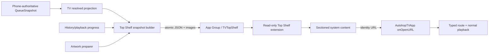

# Autohop Dynamic Top Shelf — Phased Implementation Proposal

<!--
AI CONTEXT — Docs/TVOS_DYNAMIC_TOP_SHELF_IMPLEMENTATION_PROPOSAL.md

PURPOSE: Canonical, implementation-ready plan for replacing Autohop's static
Apple TV Top Shelf brand image with dynamic Continue Listening and Up Next
episodes.

STATUS: IMPLEMENTED IN CODE on 15 August 2026 through automated build/test and
configuration gates: atomic schema/storage, artwork preparation, publisher,
embedded sectioned TVServices extension, exact display/play routes, redesigned
fallback assets, tests, validator and canonical documentation. Physical Apple
TV 1080p/4K focus, VoiceOver, offline, multiuser and signed-distribution archive
inspection remain unrecorded in the repository. Version 1.6 build 13 was
submitted on 22 August 2026; submission does not retrospectively prove those
manual gates or constitute approval.

PRIMARY DECISION: Use TVTopShelfSectionedContent with consistently square
podcast artwork. Continue Listening comes first when valid; Up Next follows in
the exact order already resolved by the tvOS app. Normal selection opens the
episode; Play/Pause begins playback. Do not start with a cinematic carousel:
Autohop's content is a scannable personal queue with square source artwork, not
a catalogue of promotional trailers.

OWNERSHIP: The main tvOS app is the only process allowed to read CloudKit,
GRDB, TVAppModel, history, playback or queue state. It atomically publishes a
small presentation snapshot and prepared images into an App Group. The Top
Shelf extension is a bounded content renderer and must not import
AutohopCore, initialize production services, fetch RSS or download artwork.

QUEUE AUTHORITY: iPhone remains authoritative for normal Up Next composition.
The extension displays the current resolved TV projection and never computes,
reorders or writes queue state.

PRIVACY: Top Shelf is visible on the shared Apple TV Home Screen. Publish only
minimum display data. Never publish descriptions, statistics, feed contents,
CloudKit identifiers, credentials, diagnostic data, stream URLs or Demo Library
fixtures. Multiuser account scope is a Phase 0 release gate.

STATIC FALLBACK: Retain valid standard and wide static Top Shelf images for
first launch, empty/invalid state and extension failure. Redesign the current
oversized mark as a calmer non-interactive fallback.

AI IMPLEMENTATION RULE: Execute phases in order. Never share the production
database with the extension, put media URLs in deep links, use titles as
identity, accept arbitrary URL routes or claim multiuser isolation without
physical-device evidence.

CANONICAL RELATED FILES: Models/QueueSnapshot.swift,
Persistence/TVProjectionStore.swift, TV/App/AutohopTVApp.swift,
TV/Navigation/TVRouter.swift, TV/Views/TVMainTabView.swift,
TV/Views/TVArtworkImage.swift, TV/AI_CONTEXT.md, SYNC_DESIGN.md, DESIGN.md,
FEATURES.md, PAGES.md and VERSION_1.6.md.
-->

## 1. Executive summary

Autohop currently supplies only static images from `TV/Media.xcassets`. When
its icon is focused in the first Home Screen row, tvOS expands the static image
over the area above the Dock. The reported giant waveform is therefore expected
fallback behaviour, not a scaling defect inside Autohop.

Apple's TVServices framework can replace that fallback with a full-screen Top
Shelf extension. The extension can display focusable episode artwork, labels,
playback progress and actions even when Autohop is not running. Autohop should
use this as a projection of its existing queue, never as another queue owner.

Recommended experience:

1. Show **Continue Listening** when one episode is genuinely resumable.
2. Show **Up Next** in the exact order shown on the tvOS Home page.
3. Remove a duplicate Continue Listening item from Up Next.
4. Use square episode/podcast artwork with system-rendered text and focus.
5. Normal selection opens the exact episode in Autohop.
6. Play/Pause on a focused item starts or resumes the exact episode.
7. Display progress only when duration and position are trustworthy.
8. Return to improved static artwork when content is missing, invalid, stale or
   unsafe for the current account scope.

The main app performs expensive and stateful work. The extension performs one
bounded local read and maps validated records to TVServices objects. This
directly follows Apple's warning that Top Shelf extensions have much lower
memory limits than tvOS apps.

## 2. Research findings

### 2.1 Current Apple APIs

Apple's [TVServices overview](https://developer.apple.com/documentation/tvservices)
states that Top Shelf is supplied by an embedded app extension and can appear
while the containing app is not running. Apple explicitly warns against
memory-intensive extension work.

Modern full-screen choices are:

- `TVTopShelfCarouselContent`: immersive full-screen imagery/video and action
  buttons.
- `TVTopShelfSectionedContent`: one focusable row organized into labeled
  collections.
- `TVTopShelfInsetContent`: large scrolling banners.

The legacy `TVTopShelfProvider`/`TVContentItem` API is deprecated. New code must
subclass `TVTopShelfContentProvider` and implement
`loadTopShelfContent(completionHandler:)`.

Each `TVTopShelfItem` requires a stable identifier for the same underlying
content across reloads. It can define:

- `displayAction` to open content/details;
- `playAction` to play content; in sectioned content the focused item's action
  is invoked by Play/Pause;
- image URLs for system-requested traits;
- an expiration date.

`TVTopShelfSectionedItem` adds image shape and `playbackProgress` in `0...1`.
After materially changing shared content, the app may call
`TVTopShelfContentProvider.topShelfContentDidChange()`. Apple describes this as
an asynchronous invalidation request, not an immediate-refresh guarantee.

### 2.2 Apple design guidance

Apple's [Top Shelf Human Interface Guidelines](https://developer.apple.com/design/human-interface-guidelines/top-shelf)
recommend content that helps people jump directly into what they care about,
prioritizes current/personalized material, supports resume playback, fills a
complete row, provides meaningful labels, avoids advertising/price-first
content and retains a static fallback that does not imply interaction.

Apple's sectioned image dimensions are:

| Shape | Actual 1x | Actual 2x | Autohop decision |
|---|---:|---:|---|
| Square | 608×608 | 1216×1216 | **Use for podcast artwork** |
| HDTV 16:9 | 908×512 | 1816×1024 | Reserve for a future editorial/video design |
| Poster 2:3 | 404×608 | 808×1216 | Do not use for ordinary podcasts |

Mixing shapes causes automatic height matching, so Version 1 should use only
square items. Podcast feeds normally provide flat art. Apple's
[image guidance](https://developer.apple.com/design/human-interface-guidelines/images)
encourages layered focusable imagery but does not require it outside app icons;
high-quality flat art with native focus is more honest than fabricated parallax.
Do not bake titles, progress bars or buttons into the bitmap.

### 2.3 Shared data and multiple users

An extension and containing app have separate sandboxes. Apple's
[App Groups guidance](https://developer.apple.com/documentation/xcode/configuring-app-groups/)
identifies an App Group as the supported file-sharing mechanism. Autohop already
uses `group.com.kevinperry.autohop` for iOS widgets. Subject to signing tests,
add this existing group to the tvOS app and Top Shelf extension, using a
dedicated `TVTopShelf/` directory and a separate schema.

Apple TV supports multiple system users. Apple's
[current-user guidance](https://developer.apple.com/documentation/TVServices/personalizing-your-app-for-each-user-on-apple-tv)
notes that apps without User Management run as the default user; enabling Runs
as Current User changes access to iCloud, preferences and other storage. Do not
enable it incidentally. Phase 0 must document current shipped behaviour and
prove an account-scope policy. If safe scope cannot be established, dynamic
content must fail closed to static fallback.

## 3. Current Autohop audit

### 3.1 Existing foundations

- `QueueSnapshot` is ordered, versioned and phone-authoritative.
- `QueueSnapshotEntry` has stable `episodeKey` plus `subscriptionID`.
- Its projection includes titles, artwork, duration, media kind and playback
  information without requiring full RSS materialization.
- `TVAppModel` already caches Up Next and Continue Listening projections.
- `TVArtworkLoader` already performs off-main fetching, disk caching and ImageIO
  downsampling.
- `TVProjectionStore` already keeps compact TV state separate from the full iOS
  database.

### 3.2 Missing components

1. `com.apple.tv-top-shelf` extension target.
2. tvOS app/extension App Group entitlements.
3. Top Shelf-specific presentation schema and atomic storage.
4. Snapshot builder/publisher and prepared square artwork.
5. `TVTopShelfContentProvider` implementation.
6. tvOS URL scheme, typed parser and pending-route owner.
7. Exact episode display/direct-play integration.
8. Extension, privacy, signing and physical-TV validation.

### 3.3 Rejected shortcut: sharing the production database

The extension must not open `TVProjectionStore` directly. Doing so would link a
memory-constrained system process to GRDB/AutohopCore, expose unnecessary
private state, require cross-process migration/coordination and make Home Screen
rendering depend on production storage health. Use a disposable materialized
presentation view, analogous to a widget snapshot.

## 4. User-experience specification

### 4.1 Sections and ordering

Publish at most two collections:

1. **Continue Listening** — zero or one episode. Exclude completed, archived,
   unplayable and effectively finished items using existing product policies.
2. **Up Next** — preserve tvOS Home order exactly; remove the Continue identity;
   exclude entries without stable identity or a playable resolution path.

Cap Version 1 at 10 total items. Prefer enough items to span the display, but
render a smaller valid personal queue rather than inventing recommendations.
With no valid items, return nil and let static fallback render.

Each item exposes episode title, podcast title, square artwork, optional
progress, stable accessibility context, display action and play action. Avoid
relative-time text or badges baked into artwork.

### 4.2 Deep-link contract

Normal selection:

```text
autohop://tv/episode?subscriptionID=<uuid>&episodeKey=<percent-encoded-key>
```

Play/Pause:

```text
autohop://tv/play?subscriptionID=<uuid>&episodeKey=<percent-encoded-key>
```

URLs contain identity only—never stream/artwork URLs, titles, progress,
CloudKit names or signed media tokens. A typed allowlist parser validates exact
scheme, host, path, keys and cardinality. The app resolves identity against its
current projection and uses normal navigation/playback. If resolution fails
after one bounded refresh, open Home and explain that the episode is no longer
available. Never substitute a different episode.

### 4.3 Static fallback redesign

Retain standard and wide assets but reduce the current waveform substantially,
add generous negative space and preserve the purple brand environment. Do not
draw fake episode cards, controls or progress. Test Apple's blur, flip, crop and
safe zones at 1080p/4K on hardware.

## 5. Architecture



### 5.1 Proposed files and target

Extension bundle ID: `com.kevinperry.autohop.TopShelf`.

```text
TVTopShelf/
├── AI_CONTEXT.md
├── Info.plist
├── AutohopTVTopShelf.entitlements
├── TopShelfContentProvider.swift
└── TopShelfContentFactory.swift

TV/TopShelf/
├── TVTopShelfSnapshot.swift
├── TVTopShelfSharedStorage.swift
├── TVTopShelfSnapshotBuilder.swift
├── TVTopShelfSnapshotPublisher.swift
└── TVTopShelfArtworkPreparer.swift

TV/Navigation/
├── TVDeepLink.swift
├── TVDeepLinkParser.swift
└── TVPendingRouteCoordinator.swift
```

Only Foundation-only schema/storage code may be shared. The extension imports
Foundation and TVServices; it must not link AutohopCore, GRDB, CloudKit, AVKit
or production image-processing services.

### 5.2 Presentation schema

```swift
struct TVTopShelfSnapshot: Codable, Equatable, Sendable {
    let schemaVersion: Int
    let generation: Int64
    let publishedAt: Date
    let accountScope: String
    let sections: [Section]
}

struct Item: Codable, Equatable, Sendable {
    let stableID: String
    let subscriptionID: UUID
    let episodeKey: String
    let episodeTitle: String
    let podcastTitle: String
    let artworkFilename1x: String
    let artworkFilename2x: String?
    let playbackProgress: Double?
    let expiresAt: Date?
}
```

Schema rules:

- Start at version 1; unknown versions fail closed.
- Increment generation only after successful publication.
- `accountScope` is a non-reversible local discriminator, never email/raw
  CloudKit identity.
- `stableID` is a deterministic digest of subscription ID and episode key.
- Episode key remains identity; titles are display only.
- Progress must be finite and clamped to `0...1`.
- Filenames are basenames, never paths.
- Maximum JSON size 128 KB, two sections and 10 total items.
- Invalid enums, duplicates, counts or paths reject the snapshot.

### 5.3 Atomic shared storage

```text
TVTopShelf/
├── current.json
├── generation-42/
│   ├── <stable-id>@1x.jpg
│   └── <stable-id>@2x.jpg
└── generation-41/       # one rollback generation
```

Publication transaction:

1. Build/validate entirely in memory.
2. Create a new generation directory.
3. Prepare all referenced art there.
4. Encode to a temporary manifest.
5. Atomically replace `current.json` only after files exist.
6. Invalidate Top Shelf only when materially changed.
7. Retain current and previous generations.
8. Delete older generations asynchronously in the main app.

The extension never writes product/domain state or downloads. It validates
containment, reads once, may atomically replace one maximum-4 KB content-free
operational heartbeat for local diagnostics, creates content and calls
completion exactly once. Missing art uses a bundled
placeholder or removes the affected item.

### 5.4 Artwork contract

- Decode/crop off-main without stretching.
- Emit color-managed 608×608 and 1216×1216 renditions.
- Bound encoded bytes and preparation concurrency to two tasks.
- Use nonrevealing deterministic filenames.
- Reuse unchanged output between generations.
- Provide branded square placeholder art.
- Cancel superseded generations safely.
- Never composite text, badges, controls or progress into artwork.

### 5.5 Publication triggers

Publish after queue order/generation, Continue identity, meaningful progress,
completion/archive, artwork availability, ready bootstrap, foreground queue
adoption, background position persistence or account scope changes. Coalesce
bursts for roughly 500–1000 ms. Do not publish every playback tick; use a
material progress delta such as 0.02 plus background/completion flushes. Skip
equivalent snapshots.

### 5.6 Extension factory

The deterministic factory must validate version, size, account scope,
freshness, item caps, unique IDs and contained images; create square sectioned
items; assign labels/progress/expiration and typed actions; then return
`TVTopShelfSectionedContent` or nil. It performs no network, CloudKit, database,
feed, image-compositing or app-model work.

### 5.7 Pending route ownership

A main-actor coordinator retains only the newest validated route during cold
bootstrap. Once usable, resolve subscription ID plus episode key, perform at
most one bounded queue refresh, confirm route generation still owns execution,
then navigate/play through existing `TVMainTabView` and `beginPlayback`. Clear
the route on success or failure. Setup remains actionable and Demo mode never
consumes a production route.

## 6. Phased implementation

### Phase 0 — Product, multiuser and signing gates

Tasks:

1. Capture current static behaviour on tvOS 26.5 and newest supported beta.
2. Test current default/current-user and CloudKit behaviour on a multiuser TV.
3. Define account discriminator and fail-closed policy.
4. Verify existing App Group registration for tvOS app and extension profiles.
5. Confirm bundle ID, automatic signing, section labels, cap and freshness.
6. Threat-model stale content visible to another household member.
7. Decide explicit-content treatment without leaking extra metadata.

Exit gates: multiuser behaviour is evidenced; no incidental Runs as Current
User change; both profiles can carry the App Group; decisions are recorded in
DESIGN.md and SYNC_DESIGN.md.

### Phase 1 — Schema and atomic storage

Build strict Foundation-only schema, injectable App Group paths, atomic writer,
bounded reader, generation retention, identity digest and corruption/traversal
rejection.

Tests: round trip; unknown version; corrupt/truncated/oversize JSON; caps;
duplicate IDs; path traversal; old-or-new atomic visibility; current-generation
retention; domain-read-only extension behaviour and bounded diagnostic heartbeat.

Exit gates: tests pass without TVAppModel; extension-facing module contains no
database type; App Group failure is recoverable.

### Phase 2 — Main-app builder and artwork

Build sections from cached TV state, preserve order, deduplicate, reuse existing
completion/final-minute/playability policies, calculate safe progress, prepare
square art, publish atomically, coalesce triggers, skip equivalents, invalidate
after success and clear on unsafe scope. Diagnostics use counts/reason codes,
never private content.

Tests: exact order; deduplication; progress validity; exclusions; cap;
equivalence; superseded generation ownership; placeholder behaviour; Demo data
never published.

Exit gates: publication never blocks focus/playback; shared files contain only
approved fields; disk/memory budgets pass.

### Phase 3 — Top Shelf extension

Add the app-extension target to `project.yml`; configure
`com.apple.tv-top-shelf`, principal provider, App Group Debug/Release
entitlements and embedding; map validated snapshot into square items and return
nil on all unavailable states.

Tests: one/two sections; stable IDs; action URLs; shape/progress; stale/invalid
nil; completion exactly once; no prohibited dependency linked.

Exit gates: Release app embeds `.appex`; signed app/extension share the exact
group; extension survives memory constraints; deleting manifest restores static
fallback.

### Phase 4 — Typed deep links

Add tvOS `autohop` scheme, strict parser, newest-route ownership, bounded
refresh, display/play semantics, resume preservation, unavailable messaging and
cold/warm/background handling.

Tests: valid matrix; scheme/host/path/query rejection; malformed UUID; duplicate
parameters; encoded episode key; no stream URL; cold launch executes once; newer
route supersedes older; stale identity never substitutes; current episode
reopens without restart.

Exit gates: every route targets exact identity, cannot bypass playback policy
and never traps launch.

### Phase 5 — Visual/accessibility and fallback

Create compliant placeholder and calmer fallback artwork; verify long titles,
contrast, Reduce Motion, VoiceOver, low-resolution/transparency, focus crop,
safe zones, localization and 1080p/4K completeness.

Exit gates: physical-TV design approval; fallback does not look interactive;
essential art survives focus; VoiceOver communicates episode, podcast, progress
and action.

### Phase 6 — Reliability and adverse states

| Scenario | Required result |
|---|---|
| App never opened / empty library | Static fallback |
| Valid queue | Dynamic Up Next |
| Continue only | One labeled collection |
| Offline after publication | Cached content within freshness policy |
| Artwork failure | Local placeholder; zero extension network |
| Corrupt/unsupported snapshot | Static fallback, no crash |
| Rapid queue changes | Latest coalesced generation wins |
| Removed selected episode | Home plus clear unavailable message |
| Cold play action | Bounded launch then exact playback |
| Slow CloudKit bootstrap | Actionable setup; route resolves or fails clearly |
| Demo active | Demo never appears in Top Shelf |
| Apple TV user switch | Approved account-scope behaviour |
| Extension killed | Deterministic reload |

Initial budgets: JSON decode under 25 ms; factory under 25 ms; JSON ≤128 KB;
current artwork ≤20 MB; ≤10 items; zero extension network/database opens; no
private content in logs. Validate with physical hardware and Instruments.

### Phase 7 — Release engineering and documentation

Extend `Scripts/validate-tvos-release.sh` to verify embedded extension, extension
metadata, matching App Group entitlements, URL scheme, fallback assets and
dependency boundary. Inspect signed archive, run clean TestFlight install,
update all canonical documents/support, add App Review instructions and record
rollback.

Exit gates: archive validation passes; clean install transitions fallback to
dynamic after valid publication; documentation and AI headers are current.

### Phase 8 — Controlled rollout

Use internal TestFlight first; test 1080p and 4K hardware; record only
generation, counts, bytes, timing buckets and reason codes; retain static
fallback as immediate rollback. Review title clarity/item count before any
richer layout.

## 7. Security and privacy controls

| Risk | Mitigation |
|---|---|
| Prior household user sees titles | Verified scope; fail closed; physical multiuser test |
| Crafted URL starts arbitrary media | Identity-only allowlist; resolve current projection |
| Artwork path traversal | Basename validation plus standardized containment |
| Partial publication | Generation directory plus atomic manifest |
| Excess extension data | Dedicated minimum presentation schema |
| Private logs | Counts/reasons only, never content or identity |
| Demo leakage | Publisher attached only to production model plus regression test |
| Stale queue | Freshness/expiration plus exact launch resolution |
| Memory termination | Bounded local renderer; no network/database/model |
| Entitlement drift | Inspect signatures for both binaries |

## 8. Observability

Suggested events: `tv.topShelf.publishScheduled`,
`publishSkippedEquivalent`, `publishSucceeded`, `publishFailed`,
`clearedForScope`, `deepLinkAccepted`, `deepLinkRejected`, `deepLinkResolved`
and `deepLinkUnavailable`.

Allowed metadata: schema/generation, section/item count, bytes, artwork count,
elapsed bucket, reason code and cold/warm category. Forbidden: titles, episode
key, subscription UUID, any URL, account identity, CloudKit fields or full deep
link.

## 9. Rollback

Removing/clearing `current.json` makes the extension return nil and restores
static fallback. Shared snapshots are disposable and cannot affect queue,
history, playback, CloudKit or stats. Deep-link parsing may remain inert.
Never require a production database migration to disable Top Shelf.

## 10. Explicit Version 1 exclusions

- cinematic/video previews or full-screen carousel;
- editorial Discover recommendations;
- ads, prices or promotional subscriptions;
- queue editing;
- extension CloudKit/RSS/database access;
- more than two collections;
- new profile system or incidental Runs as Current User;
- Demo episodes on the system Home Screen;
- AI-generated/composited podcast artwork.

## 11. Definition of done

Complete only when modern sectioned content ships in the Release extension;
Continue/Up Next match the app; artwork/progress are correct; actions resolve
exact identities; cold/warm/offline/corrupt/stale states are safe; extension has
no production-store/network dependency; App Group writes are atomic/minimal;
Demo cannot leak; multiuser scope is physically verified; fallback is improved;
tests, TestFlight and signed archive pass; and all AI/canonical docs are current.

Until then, Version 1.6 must call this planned or partially implemented.

## 12. Primary Apple references

- [TVServices](https://developer.apple.com/documentation/tvservices)
- [Building a Full Screen Top Shelf Extension](https://developer.apple.com/documentation/tvservices/building-a-full-screen-top-shelf-extension)
- [Top Shelf HIG](https://developer.apple.com/design/human-interface-guidelines/top-shelf)
- [TVTopShelfContentProvider](https://developer.apple.com/documentation/tvservices/tvtopshelfcontentprovider)
- [TVTopShelfSectionedContent](https://developer.apple.com/documentation/tvservices/tvtopshelfsectionedcontent)
- [TVTopShelfSectionedItem](https://developer.apple.com/documentation/tvservices/tvtopshelfsectioneditem)
- [TVTopShelfAction](https://developer.apple.com/documentation/tvservices/tvtopshelfaction)
- [Images HIG](https://developer.apple.com/design/human-interface-guidelines/images)
- [Configuring App Groups](https://developer.apple.com/documentation/xcode/configuring-app-groups/)
- [Personalizing for each Apple TV user](https://developer.apple.com/documentation/TVServices/personalizing-your-app-for-each-user-on-apple-tv)
